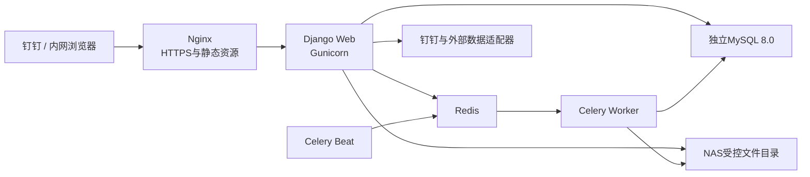

# 产品/项目全生命周期管理系统技术架构设计

版本日期：2026-06-30

状态：已确认技术基线

关联文档：

- `2026-06-26-product-lifecycle-architecture-design.md`
- `../../prd/00-product-lifecycle-master-prd.md`
- `../../prd/05-platform-permission-file-integration-prd.md`

## 1. 文档目的

本文定义系统正式开发使用的技术栈、运行拓扑、资源边界、文件存储、发布、备份和工程质量基线。

2026-05-15 旧 MVP 设计中的 Node.js、SQLite 和纯 HTML/CSS/JavaScript 仅代表历史原型实现，不再作为后续正式开发的技术基线。历史原型可用于验证交互和业务理解，但正式系统不得同时维护两套后端或两套数据模型。

## 2. 已确认约束

- 企业内部约 200 名员工；
- 同时进行的项目约 10 个；
- 受控文件增长约 100GB/年；
- 应用服务器运行 Debian 13；
- 服务器为 2 × Intel Xeon Gold 6526Y、128GB 内存，但还承载其他应用；
- 系统首期总资源上限为 6 vCPU、8GB 内存；
- MySQL 8.0 位于独立数据库服务器，可创建独立数据库和账号；
- 文件存储使用群晖 DS1621+；
- 公司可提供固定内网域名和 HTTPS 证书；
- 可提供隔离的测试环境；
- 代码托管使用 Gitee；
- 当前没有私有 Docker 镜像仓库；
- CI 生成版本化离线发布包，管理员人工部署；
- 数据库和文件可配置每日自动备份；
- 首期 RPO ≤ 24 小时、RTO ≤ 24 小时。

## 3. 架构决策

### 3.1 采用模块化单体

系统采用 Django 模块化单体，不在首期拆分微服务。

理由：

- 核心业务高度依赖事务、权限、审计和跨模块一致性；
- 当前用户量和并发量不需要微服务扩展能力；
- 单体部署更符合现有运维能力；
- 清晰的应用模块和服务接口仍可为未来拆分保留边界。

模块之间通过应用服务和明确接口协作，不允许跨模块随意写入对方数据表。

### 3.2 不采用重型流程引擎

生命周期主干、阶段门和状态迁移由领域状态机与应用服务显式实现。模板、任务、交付物、确认要求和授权规则提供配置能力，但不引入 BPMN/Camunda 等重型流程平台。

重大状态迁移必须由后端校验，不得由前端直接修改状态字段。

## 4. 总体运行拓扑

只有 Nginx 对用户开放 HTTPS 端口。Django、Redis、Celery 不直接暴露到用户网络。

## 5. 技术栈

### 5.1 后端

- Python 3.13；
- Django 5.2 LTS；
- Django REST Framework 3.16；
- Gunicorn；
- Celery 5.6；
- Redis；
- pytest、pytest-django；
- OpenAPI 作为前后端接口契约。

Django 负责领域模型、事务、权限、审计、后台管理、文件元数据和API。Celery只处理提醒、通知、导入、统计和可重试的后台任务，不承载不可恢复的业务事实。

### 5.2 前端

- Node.js 24 LTS作为构建环境；
- Vue 3；
- TypeScript；
- Vite；
- Vue Router；
- Pinia；
- Element Plus；
- Vitest；
- Playwright。

前端按业务域组织页面和状态，不复制后端权限规则。按钮隐藏只是体验优化，所有权限和状态迁移必须由后端重新校验。

### 5.3 数据库

使用独立 MySQL 8.0 数据库和最小权限账号：

- 字符集使用 `utf8mb4`；
- 存储引擎使用 InnoDB；
- 启用严格 SQL 模式；
- 事务隔离级别使用 `READ COMMITTED`；
- Django连接复用初始设为约60秒并启用健康检查；
- 应用账号连接数上限初始建议为30；
- 仅允许应用服务器和受控管理地址访问数据库端口；
- 网络条件允许时启用MySQL TLS。

数据库保存业务事实、权限、审计、文件元数据和版本关系，不保存文件二进制内容。

## 6. 后端模块边界

首期在同一 Django 工程内划分以下应用模块：

- `identity`：用户、组织、钉钉身份绑定；
- `authorization`：RBAC、ABAC、专项授权和权限判定；
- `opportunities`：提案、立案、立项候选、暂缓、Pass和复议；
- `products`：产品资产、产品档案、属性组和版本；
- `projects`：项目实例、成员、RACI和生命周期；
- `stage_gates`：阶段门、决策、例外通过；
- `work_items`：任务、交付物、专业确认和排期；
- `documents`：文件、受控版本、校验值和下载授权；
- `operations`：经营监控、风险信号和经营议题；
- `integrations`：钉钉、外部数据、Excel/CSV导入；
- `notifications`：站内通知和钉钉提醒；
- `audit`：不可抵赖的关键操作记录；
- `configuration`：模板、字典和版本化配置；
- `platform`：运行状态、备份记录和管理能力。

模块名是代码边界，不代表独立部署服务。

## 7. 身份、会话与权限

- 钉钉提供身份认证和企业成员信息；
- 系统账号、关键角色和业务权限由系统管理员配置，不根据钉钉身份自动授予；
- Web端采用同源HTTPS和服务端会话；
- Cookie必须设置 `HttpOnly`、`Secure` 和适当的 `SameSite`；
- 所有写操作启用CSRF防护；
- 平台管理权与业务数据访问权分离；
- 权限采用RBAC + ABAC + 操作留痕；
- 文件预览、下载、导出和分享分别进行权限判断；
- 关键业务操作在同一事务内写入审计记录，审计失败则操作失败。

首期不使用JWT作为浏览器主会话方案。未来开放外部API时再为机器调用单独设计令牌。

## 8. 文件存储

群晖 DS1621+ 作为存储设备，不运行Django、MySQL、Redis或其他应用服务。

建议配置：

- 创建独立Btrfs共享目录，例如 `plm-files`；
- Debian宿主机通过NFSv4.1挂载到 `/srv/plm-files`；
- Django和Celery容器以绑定挂载方式使用 `/data/files`；
- 使用固定的非root UID/GID；
- 用户不能绕过应用直接访问受控目录。

文件规则：

- 实际对象键使用UUID，不使用用户文件名作为磁盘路径；
- MySQL记录原文件名、对象键、大小、MIME、SHA-256、版本、上传者和业务关联；
- 正式受控版本不可原位覆盖；
- 更新产生新版本，历史决策继续引用原版本；
- 下载前实时校验用户、业务对象、文件动作和专项授权；
- 临时上传未完成关联时必须清理，不能产生孤立文件。

应用通过Django Storage抽象访问文件，未来迁移到S3兼容对象存储时不改变领域模型。

## 9. 异步任务

Redis只作为缓存、Celery消息代理和短期运行状态，不是业务事实来源。

Celery任务必须：

- 可重复执行且结果幂等；
- 设置超时、有限重试和退避；
- 保存业务对象ID而不是传递大文件或完整对象；
- 失败后形成可见记录；
- 能根据MySQL中的权威记录重新生成；
- 不自动执行重大阶段门决策。

首期使用一个Worker、并发数2。只有监控证明通知、导入或统计相互阻塞时才拆分队列。

## 10. 环境隔离

测试与生产环境必须分别使用：

- 独立域名和HTTPS配置；
- 独立Docker Compose项目名；
- 独立MySQL数据库和账号；
- 独立NAS目录；
- 独立Redis数据；
- 独立密钥和环境变量；
- 清晰的页面环境标识。

生产数据不得复制到测试环境；确需排障时只能使用脱敏数据。

## 11. 容器与资源预算

| 服务 | 首期运行方式 | 资源上限 |
|---|---|---:|
| Nginx + Vue静态资源 | 单实例 | 0.5 CPU / 256MB |
| Django + Gunicorn | 2进程 × 4线程 | 2 CPU / 3GB |
| Celery Worker | 单Worker，并发2 | 2 CPU / 2GB |
| Celery Beat | 单实例 | 0.25 CPU / 256MB |
| Redis | 单实例 | 0.5 CPU / 768MB |
| 机动余量 | 发布、备份等短时任务 | 约0.75 CPU / 1.75GB |

原则：

- Docker Compose为各服务设置CPU和内存硬限制；
- 不根据服务器总核心数自动增加进程；
- 日志启用轮转，初始建议单文件20MB、保留5份；
- 设置健康检查和合理的重启策略；
- 不在首期常驻运行文档转码、全文检索或杀毒扫描服务；
- 扩容必须依据持续监控数据逐项进行。

## 12. 网络与安全边界

- 用户只通过固定内网HTTPS域名访问；
- Nginx终止TLS并转发同源API请求；
- Redis仅位于容器内部网络；
- MySQL防火墙只允许指定来源IP；
- NAS只允许应用服务器通过NFS访问指定共享目录；
- 密钥、数据库密码和钉钉凭据不进入Git；
- 生产环境变量文件位于部署目录之外并限制读取权限；
- API错误不向普通用户泄露堆栈、数据库语句或外部凭据。

## 13. CI与发布

### 13.1 CI

Gitee仓库启用分支保护和合并审查。CI至少执行：

- Python格式与静态检查；
- 后端单元测试和数据库集成测试；
- 前端类型检查、单元测试和生产构建；
- API契约检查；
- Docker镜像构建；
- 发布包校验值生成。

### 13.2 离线发布包

没有私有镜像仓库，因此CI生成版本化离线发布包，至少包含：

- Django应用镜像，供Web、Celery Worker和Beat共用；
- Vue/Nginx镜像；
- 生产Docker Compose配置模板；
- 数据库迁移与部署脚本；
- 发布清单、版本号、提交号和SHA-256校验文件；
- 回滚说明。

测试环境必须验证与生产相同的发布包，不允许在生产服务器拉取源码或现场编译。

### 13.3 人工部署

CI不保存生产服务器凭据，也不直接连接生产服务器。授权管理员人工上传发布包，统一部署脚本依次执行：

1. 校验发布包和版本；
2. 检查环境、磁盘和依赖；
3. 确认最近备份状态；
4. 加载镜像；
5. 执行兼容性检查和数据库迁移；
6. 启动服务；
7. 执行健康检查和关键路径冒烟测试；
8. 记录发布人、时间、版本和结果；
9. 失败时按预案回滚。

保留最近3至5个发布版本。数据库迁移优先采用向前兼容的扩展—迁移—收缩方式，避免镜像回滚后数据库结构不兼容。

## 14. 备份与恢复

首期目标为RPO不超过24小时、RTO不超过24小时。

- MySQL每日自动备份；
- NAS受控文件每日快照或备份；
- 数据库与文件备份复制到独立于生产设备的存储位置；
- 备份加密并限制访问；
- 备份失败通知系统管理员并在运行看板显示；
- 定期执行数据库、文件及关联关系的联合恢复验证；
- 恢复验证必须记录时间、范围、耗时和结果。

仅有备份文件不代表目标达成，必须通过恢复演练验证。

## 15. 可观测性

首期采用轻量运行保障，不建设复杂监控平台：

- Nginx访问和错误日志；
- Django结构化应用日志；
- Celery任务状态和失败记录；
- 外部同步批次和错误记录；
- 数据库连接、存储容量和备份状态；
- 容器健康检查；
- 系统内运行看板；
- 严重运行异常通知管理员。

业务审计日志与技术运行日志分开保存。技术日志可轮转，业务审计按业务保留规则管理。

## 16. 测试策略

- 领域规则：单元测试，覆盖状态迁移、权限和例外；
- 数据访问：MySQL集成测试，不以SQLite替代正式数据库行为；
- API：请求、响应、权限和并发冲突测试；
- 前端：Vitest覆盖状态和组件逻辑；
- 关键流程：Playwright覆盖登录、提案、阶段门、文件、产品档案和发布后操作；
- 文件：版本、校验、授权、失败清理和NAS异常测试；
- 发布：测试环境执行迁移、健康检查、冒烟和回滚演练；
- 恢复：定期验证数据库记录与文件对象的一致性。

测试必须表达业务规则为什么存在，不能只验证页面元素或HTTP状态码。

## 17. 首期明确不建设

- 微服务和服务网格；
- Kubernetes；
- Harbor等私有镜像仓库；
- BPMN流程引擎；
- Elasticsearch或独立全文检索集群；
- 数据仓库和实时流处理平台；
- 常驻文档转码集群；
- NAS上的应用运行环境；
- 钉钉内直接处理业务；
- 多租户计费和客户开通体系。

这些能力只有在真实规模、法规或业务需求出现后再评估，不能作为首期依赖。

## 18. 验收基线

技术架构达到可进入实施计划的条件必须满足：

- 测试与生产配置可独立部署；
- 业务服务在6 vCPU、8GB上限内稳定运行；
- 正常业务状态只能通过后端领域服务迁移；
- 权限、审计和文件下载均由后端强制执行；
- MySQL事务与文件版本关系可追溯；
- 同一离线发布包先通过测试环境再进入生产；
- 发布失败存在可执行回滚路径；
- 数据库和文件可以在24小时内从有效备份恢复；
- 旧Node.js/SQLite原型不再作为正式开发依赖。

## 19. 后续文档

本文确认后，下一步应基于本技术架构和PRD编写实施计划，包括：

- 仓库目录与工程初始化；
- 数据模型和模块实施顺序；
- API契约；
- 权限与审计基础设施；
- 文件存储适配器；
- 测试基线；
- Docker Compose环境；
- CI与离线发布脚本；
- 分阶段验收和迁移方案。
