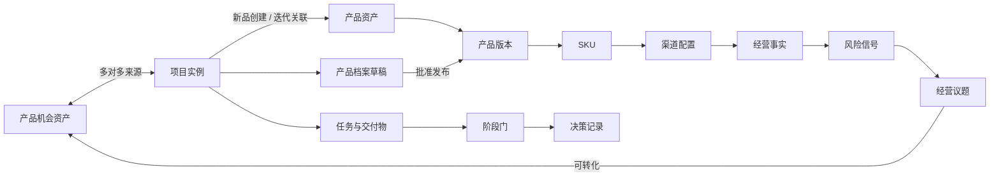

# 产品/项目全生命周期管理系统总 TRD

版本：V0.1

日期：2026-06-30

状态：已确认基线

基线确认日期：2026-07-02

上游文档：

- `../prd/00-product-lifecycle-master-prd.md`
- `../superpowers/specs/2026-06-26-product-lifecycle-architecture-design.md`
- `../superpowers/specs/2026-06-30-technical-architecture-design.md`

## 1. 文档目的

本文定义所有领域模块共同遵守的详细技术规则，包括代码边界、数据建模、API、事务、并发、权限、审计、文件一致性、异步任务和测试基线。

各领域 TRD 负责定义本领域的表、状态机、接口和异常场景，但不得改变本文约定。确需改变时，必须先修订总 TRD 并评估所有领域影响。

本文不是实施计划，不规定具体编码批次、工期或人员安排。

## 2. TRD 文档体系

| 文档 | 负责范围 |
|---|---|
| `00-system-master-trd.md` | 全局技术规则和跨域契约 |
| `01-opportunity-case-project-trd.md` | 提案、立案、立项、复议及项目创建 |
| `02-product-profile-version-migration-trd.md` | 产品、版本、SKU、渠道、档案和存量迁移 |
| `03-development-launch-execution-trd.md` | 项目执行、任务、交付物、专业确认和上市 |
| `04-operations-iteration-retirement-trd.md` | 经营数据、风险、迭代和退市 |
| `05-platform-permission-file-integration-trd.md` | 身份、权限、文件、配置、通知、集成和运行保障 |

PRD需求编号是追踪主键。TRD、测试和实施计划必须引用原编号，不得另造含义相同但无法追踪的新需求。

## 3. 技术基线

- Python 3.13；
- Django 5.2 LTS；
- Django REST Framework 3.16；
- MySQL 8.0、InnoDB、`utf8mb4`、`READ COMMITTED`；
- Redis + Celery；
- Vue 3 + TypeScript + Vite + Pinia + Element Plus；
- Nginx + Gunicorn；
- Docker Compose；
- NAS NFSv4.1受控文件目录；
- OpenAPI 3作为接口契约；
- pytest、Vitest和Playwright。

旧Node.js + SQLite原型不作为正式系统依赖或数据模型来源。

## 4. 系统分层

```text
Vue 页面与状态
        ↓
REST API / OpenAPI
        ↓
应用服务：用例编排、事务、权限、审计
        ↓
领域模型：聚合、规则、状态迁移
        ↓
Django ORM / Storage / Integration Adapter
        ↓
MySQL / Redis / NAS / 外部系统
```

### 4.1 分层职责

- API层：解析请求、调用应用服务、序列化响应，不实现业务决策；
- 应用服务：建立事务、执行权限检查、调用领域规则、登记审计和事件；
- 领域层：表达不变量、状态机和实体行为，不依赖HTTP；
- 基础设施层：实现数据库、文件、消息和外部系统适配；
- 前端：呈现状态和发起命令，不作为权限或流程正确性的最终保障。

禁止View、Serializer、Celery任务或前端组件直接拼接多表写操作绕过应用服务。

## 5. Django模块边界

正式后端模块使用技术架构中确定的应用边界：

`identity`、`authorization`、`opportunities`、`products`、`projects`、`stage_gates`、`work_items`、`documents`、`operations`、`integrations`、`notifications`、`audit`、`configuration`、`platform`。

边界规则：

- 模块拥有自己的模型和写入逻辑；
- 其他模块通过公开应用服务读取或发出命令；
- 查询场景允许使用专门查询服务跨表读取；
- 禁止跨模块直接修改模型；
- 禁止循环依赖；
- 通用代码必须具有两个以上稳定使用方，否则保留在领域模块内；
- 模块名是代码边界，不是独立服务或独立数据库。

## 6. 核心对象关系



产品机会资产、项目实例和产品资产必须保持独立身份，不允许用单表状态字段模拟三个对象。

## 7. 聚合与写入边界

首期主要聚合根：

- 产品机会资产；
- 项目实例；
- 产品资产；
- 产品档案草稿；
- 阶段门实例；
- 交付物实例；
- 经营议题；
- 配置模板版本；
- 外部数据接入批次。

一次命令原则上只修改一个聚合。需要跨聚合保持强一致的业务动作必须由同一应用服务在一个数据库事务中完成，并在领域TRD中明确列出。

立项通过、产品档案发布、首次上市和退市属于必须明确跨聚合事务边界的动作。

## 8. 数据建模规范

### 8.1 标识

- 数据库主键使用无业务含义的 `BIGINT`；
- 对外API使用不可猜测的UUID `public_id`；
- 用户界面展示单独的业务编号，不暴露数据库主键；
- 外部系统标识以来源系统、对象类型和外部ID组成唯一关系。

### 8.2 组织边界

首期只运行一个企业组织，但核心业务表必须包含 `organization_id`。所有查询默认带组织范围，不实现租户计费、自助开通或跨租户运营。

### 8.3 通用字段

业务实体按需要包含：

- `id`、`public_id`、`organization_id`；
- `created_at`、`created_by`；
- `updated_at`、`updated_by`；
- `version_no`：乐观并发版本号；
- 领域状态字段；
- 归档或失效字段。

数据库时间统一保存UTC，界面按Asia/Shanghai显示。金额和计量值使用定点小数，不使用浮点数。

### 8.4 状态与删除

- 状态使用代码常量和数据库字符串字段，不使用MySQL ENUM；
- 状态迁移必须经领域方法执行；
- 已进入正式流程的业务记录不做物理删除；
- 不建立全局通用“软删除”机制；
- 撤回、作废、Pass、失效和归档使用明确领域状态；
- 临时上传、失败导入等无业务价值的技术记录可按保留策略清理。

### 8.5 版本和快照

- 可变草稿与不可变发布版本分开存储；
- 阶段门引用具体文件版本、产品草稿版本和数据快照；
- 快照内容一经决策确认不可修改；
- 模板发布形成不可变版本，项目创建时复制项目快照；
- 后续模板更新不回写已创建项目。

## 9. API规范

### 9.1 资源和路径

- API前缀使用 `/api/v1`；
- 路径使用复数名词和短横线；
- 查询使用GET，创建使用POST，局部更新使用PATCH；
- 业务命令使用明确动作端点，例如 `/stage-gates/{id}/submit`；
- 不允许客户端直接PATCH关键状态字段；
- 文件上传和下载使用专用端点。

### 9.2 请求与响应

- 使用JSON和UTF-8；
- 日期时间使用带时区的ISO 8601；
- 列表统一分页，默认按稳定字段排序；
- 金额、比例和高精度数值以字符串传输；
- 响应返回 `public_id` 和业务编号，不返回数据库主键；
- OpenAPI文档是前端类型生成和接口测试的契约来源。

所有路径示例中的`{id}`均表示资源的`public_id`，不表示数据库`BIGINT`主键。

### 9.3 错误结构

统一错误响应：

```json
{
  "code": "STAGE_GATE_PRECONDITION_FAILED",
  "message": "阶段门提交条件未满足",
  "details": [],
  "trace_id": "..."
}
```

- `code`稳定供程序识别；
- `message`供用户理解；
- `details`提供字段或前置条件问题；
- `trace_id`关联技术日志；
- 不返回堆栈、SQL、服务器路径或外部凭据。

### 9.4 幂等

立项通过、产品发布、阶段门决策、导入提交等关键命令必须支持业务幂等。重复请求返回第一次成功结果或明确冲突，不得创建重复项目、版本或决策。

外部调用和批量导入使用业务幂等键；领域TRD定义具体唯一约束。

### 9.5 全局代码值

所有阶段门统一使用以下结果代码：

- `APPROVED`：通过；
- `APPROVED_WITH_EXCEPTION`：带例外通过；
- `NEEDS_INFO`：待补充；
- `DEFERRED`：暂缓推进；
- `PASSED`：Pass。

四个重大阶段门代码固定为：

- `PROPOSAL_TO_CASE`；
- `CASE_TO_PROJECT`；
- `FIRST_LAUNCH`；
- `PRODUCT_RETIREMENT`。

阶段处理方式固定为：

- `EXECUTE`；
- `REUSE`；
- `SIMPLIFY`；
- `EXEMPT`；
- `NOT_APPLICABLE`；
- `PARALLEL`。

子TRD和代码不得为相同含义创建另一组状态值。

## 10. 身份、会话和CSRF

- 钉钉完成身份认证，系统完成账号绑定和授权；
- 浏览器使用同源HTTPS服务端会话；
- Cookie设置 `HttpOnly`、`Secure` 和适当的 `SameSite`；
- 所有写请求启用CSRF校验；
- 会话失效、用户停用或关键角色撤销后，新请求立即重新判权；
- 钉钉身份或组织关系不自动授予关键业务角色。

## 11. 权限决策契约

每次权限判断至少接收：

```text
主体 + 动作 + 资源 + 当前上下文
```

- 主体：用户、全局角色、项目身份、专项授权；
- 动作：查看、编辑、提交、确认、决策、下载、导出、授权等；
- 资源：业务对象、字段、文件版本或数据集合；
- 上下文：组织、阶段、状态、项目成员关系、数据等级和有效时间。

规则：

- 默认拒绝；
- 平台管理员不默认获得敏感业务数据；
- 列表查询先按权限过滤，不能先查出后在前端隐藏；
- 对象详情、字段、文件、下载和导出分别判权；
- 关键命令在事务内再次判权，不能依赖页面打开时的旧结果；
- 权限拒绝不泄露对象是否存在。

详细角色、策略合并和专项授权规则由05领域TRD定义。

## 12. 事务与并发

### 12.1 事务

- 所有业务命令由应用服务显式建立事务；
- 外部HTTP调用和大文件传输不放在长事务内；
- 事务成功后再触发异步分发；
- 审计失败时关键业务事务整体失败；
- 同一动作的业务写入、决策引用和审计必须一致。

### 12.2 并发

- 普通编辑使用 `version_no` 乐观锁；
- 客户端更新时提交当前版本号；
- 版本不匹配返回冲突并要求刷新，不静默覆盖；
- 阶段门决策、立项创建和产品版本发布使用行锁或等效唯一约束；
- 数据库唯一约束是防止重复创建的最终保障；
- 领域TRD必须列出可能竞争的命令和锁定对象。

## 13. 领域事件与异步任务

业务事务可以登记领域事件，例如：

- 提案已提交；
- 阶段门已决策；
- 项目已创建；
- 产品版本已发布；
- 风险信号已生成；
- 任务已逾期。

需要可靠异步处理的事件写入MySQL事件发件箱。后台分发器将其投递到Celery，成功后标记完成，失败保留重试信息。

约束：

- 领域事件是内部契约，不直接等同外部API；
- 消费者必须幂等；
- 通知失败不回滚已经完成的业务决策；
- 重大决策不得由异步任务自动完成；
- Redis丢失不能造成业务事实丢失；
- 发件箱按保留策略归档，不作为永久业务履历。

## 14. 审计规范

关键审计记录至少包含：

- 操作人及其当时身份；
- 动作代码；
- 业务对象类型和标识；
- 操作前后关键状态；
- 决策、例外或变更说明；
- 关联文件版本和数据快照；
- 时间、请求来源和 `trace_id`；
- 成功或失败结果。

审计只记录必要业务变化，不保存密码、令牌、完整请求头或无关个人数据。审计记录不可由普通管理员修改。

## 15. 文件与数据库一致性

文件系统和MySQL无法使用同一事务，因此采用状态化补偿流程：

1. 文件写入隔离临时目录并计算SHA-256；
2. 校验大小、类型和上传权限；
3. 数据库创建 `PENDING` 文件版本记录；
4. 将文件移动到UUID正式对象键；
5. 数据库将版本标记为 `ACTIVE` 并关联业务对象；
6. 任一步失败均记录原因并清理或进入补偿队列。

只有 `ACTIVE` 文件可被引用和下载。后台任务定期检查超时 `PENDING` 记录、孤立临时文件和缺失对象，但不得自动删除已进入正式版本链的文件。

文件更新必须创建新版本；阶段门、专业确认和历史决策继续引用原版本。

## 16. 外部集成规范

所有钉钉和业务系统集成通过 `integrations` 适配器执行：

- 领域模块不直接调用第三方SDK；
- 保存来源系统、外部ID、同步时间和批次；
- 接入批次记录输入数量、成功、失败、跳过和错误明细；
- 重试不得产生重复业务对象；
- 外部系统不可用时保留已有有效数据；
- 人工确认值覆盖接口展示值时保留原始事实和覆盖记录；
- 决策使用的数据必须形成不可变快照。

## 17. 前端技术约束

- 页面按业务域组织，不按接口或数据库表组织；
- Pinia只保存跨页面共享状态，页面局部状态保留在组件内；
- API类型由OpenAPI生成，禁止长期维护重复手写类型；
- 路由守卫只提供访问体验，不能替代后端权限；
- 关键提交按钮必须防止重复点击并处理幂等响应；
- 并发冲突明确提示刷新和比较，不自动覆盖；
- 生命周期状态、阶段门结果和权限动作使用统一字典；
- 敏感字段不进入前端日志、URL查询参数或浏览器持久缓存。

## 18. 日志与可观测性

技术日志统一包含时间、级别、服务、环境、`trace_id`、用户标识和事件代码。

必须监控：

- Web健康状态和错误率；
- Celery队列积压和失败任务；
- MySQL连接和慢查询；
- Redis可用性；
- NAS挂载、容量和文件一致性；
- 外部同步失败；
- 数据库和文件备份结果；
- 最近恢复验证结果。

技术日志轮转保存，业务审计按业务规则保存，两者不得混用。

## 19. 测试基线

### 19.1 测试层级

- 领域单元测试：状态机、不变量和权限规则；
- 应用服务测试：事务、审计、幂等和跨聚合动作；
- MySQL集成测试：约束、锁、隔离级别和查询；
- API契约测试：请求、响应、错误码和OpenAPI；
- 文件测试：版本、补偿、缺失对象和权限；
- 前端测试：关键组件和页面状态；
- E2E测试：新品、老品迭代、退市和迁移主路径；
- 恢复测试：数据库记录与文件对象联合恢复。

### 19.2 不允许的替代

- 不以SQLite测试替代MySQL关键行为；
- 不只测试HTTP 200而忽略业务结果；
- 不用前端隐藏测试代替后端权限测试；
- 不用Mock覆盖本应验证的数据库唯一约束和并发行为。

## 20. 性能与容量基线

首期按200名员工、10个并行项目和100GB/年文件增量设计：

- 所有列表必须分页；
- 常用筛选字段建立组合索引；
- 文件不经过Django进程一次性读入内存；
- 批量导入分批校验和提交；
- 看板使用查询服务或受控汇总，不在请求中执行无界计算；
- Celery首期并发数2；
- 应用整体受6 vCPU、8GB硬限制；
- 未经测量不增加常驻服务和并发进程。

领域TRD需标出高增长表及主要查询索引。

## 21. 数据迁移规则

- 迁移脚本可重复执行并生成批次报告；
- 存量产品允许部分字段缺失，但必须标记完整度；
- 在途项目从真实当前阶段继续，不补造历史阶段门；
- 迁移数据必须标记来源、迁移时间和确认人；
- 导入基线经产品总监确认后才能成为有效事实；
- 迁移失败不得留下不可识别的半成品正式资产。

## 22. 需求追踪

| 需求 | 总TRD落实位置 | 领域TRD |
|---|---|---|
| GLB-001 | 查询、分页和前端约束 | 01、03、04 |
| GLB-002 | 核心对象关系 | 01、02 |
| GLB-003 | 核心对象关系 | 01 |
| GLB-004 | 版本、快照和发布规则 | 02 |
| GLB-005 | 聚合、事务与并发 | 02、03 |
| GLB-006 | 文件一致性和版本规则 | 03、05 |
| GLB-007 | 状态迁移和重大命令规则 | 01、03、04 |
| GLB-008 | 模块边界和权限契约 | 03、05 |
| GLB-009 | 权限决策与审计 | 05 |
| GLB-010 | 数据迁移规则 | 02、03 |
| GLB-011 | 事件、集成和快照 | 04 |
| GLB-012 | 身份、会话和集成 | 05 |
| NFR-001 | 性能与容量基线 | 全部 |
| NFR-002 | 文件和容量基线 | 05 |
| NFR-003 | 备份监控和恢复测试 | 05 |
| NFR-004 | 备份监控和恢复测试 | 05 |
| NFR-005 | 默认拒绝和审计 | 05 |
| NFR-006 | 版本、快照和文件规则 | 01、02、03、04、05 |
| NFR-007 | 组织边界 | 全部 |

## 23. 子TRD完成标准

每份领域TRD必须至少包含：

- 范围、上游需求和非目标；
- 领域对象和ER关系；
- 表级设计及关键索引；
- 状态机和合法迁移表；
- 应用服务命令和查询；
- API清单和错误码；
- 权限动作及资源范围；
- 事务、并发、幂等和唯一约束；
- 审计事件；
- 异步任务和失败补偿；
- 测试场景；
- PRD需求追踪矩阵；
- 明确的未决项或“无未决项”结论。

未达到该标准的领域TRD不能进入实施计划。

## 24. 未决项

无阻塞实施的架构未决项。业务模板、字段字典、角色—动作矩阵、指标阈值和数据映射属于实施配置，不改变本文技术边界。
