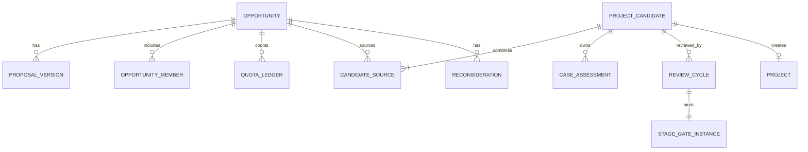

# TRD 01：提案—立案—立项

版本：V0.1

日期：2026-06-30

状态：已确认基线

基线确认日期：2026-07-02

上游文档：

- `../prd/01-opportunity-case-project-prd.md`
- `00-system-master-trd.md`

## 1. 范围与非目标

本文设计产品机会资产从提案草稿、进入立案、立案评估到立项创建项目的技术实现，覆盖联合提案、季度额度、重大阶段门、暂缓、Pass、复议、合并和拆分。

不设计立项后的任务执行细节、产品档案字段和通用权限策略内部实现；分别由03、02和05领域TRD负责。

## 2. 模块与依赖

主要写模型归属：

- `opportunities`：机会、提案版本、成员、额度、拟立项方案、暂缓和复议；
- `stage_gates`：提案进入立案、立案进入立项两个重大阶段门；
- `projects`：立项通过后创建项目；
- `products`：创建研发中产品或产品变更草稿；
- `work_items`：创建立案评估任务及项目模板实例；
- `documents`：绑定受控文件版本；
- `authorization`、`audit`、`notifications`：权限、审计和通知。

`opportunities`不得直接写其他模块模型。跨域创建由应用层编排服务完成。

## 3. 领域模型

### 3.1 核心关系

### 3.2 建模结论

- `Opportunity`是长期存在的产品机会资产；
- `ProposalVersion`保存每次提交或评审使用的不可变提案版本；
- `ProjectCandidate`是立项前的拟立项方案，承载立案负责人、评估和立项阶段门；
- `CandidateSource`实现机会与拟立项方案多对多；
- 一个拟立项方案通过后只创建一个项目；
- 一个机会可以产生多个拟立项方案，实现拆分；
- 多个机会可以进入同一拟立项方案，实现合并；
- 合并、拆分不覆盖来源机会及其贡献和额度记录。

机会进入多个拟立项方案后，不再用机会表上的单一阶段字段表达每个方案进度；机会总体状态由来源方案状态汇总，具体状态以拟立项方案为准。

## 4. 表设计

表名使用Django应用前缀；以下省略总TRD规定的通用字段。

### 4.1 `opportunities_opportunity`

| 字段 | 类型 | 约束/说明 |
|---|---|---|
| `business_no` | varchar(32) | 组织内唯一，仅内部业务展示 |
| `title` | varchar(200) | 当前标题 |
| `public_summary` | text | 立案后可公开摘要 |
| `initial_type` | varchar(32) | NEW/ITERATION/UNDECIDED |
| `proposal_owner_id` | bigint | 正式提案负责人 |
| `owner_department_id` | bigint | 额度归属部门，可空 |
| `quota_owner_type` | varchar(16) | USER/DEPARTMENT |
| `quota_owner_id` | bigint | 归属主体 |
| `proposal_status` | varchar(32) | 当前提案状态 |
| `current_version_id` | bigint | 当前可编辑或已提交版本 |
| `visibility_level` | varchar(32) | 数据等级 |
| `archived_at` | datetime | 归档时间，可空 |

索引：

- 唯一：`organization_id, business_no`；
- 普通：`organization_id, proposal_status, updated_at`；
- 普通：`proposal_owner_id, proposal_status`；
- 普通：`quota_owner_type, quota_owner_id, created_at`。

### 4.2 `opportunities_proposal_version`

| 字段 | 类型 | 约束/说明 |
|---|---|---|
| `opportunity_id` | bigint | 所属机会 |
| `version_number` | int | 机会内递增 |
| `version_status` | varchar(20) | DRAFT/SUBMITTED/LOCKED/SUPERSEDED |
| `market_analysis` | longtext | 四项核心内容之一 |
| `core_selling_points` | longtext | 四项核心内容之一 |
| `target_users_needs` | longtext | 四项核心内容之一 |
| `suggested_retail_price` | decimal(14,2) | 建议零售价 |
| `content_snapshot` | json | 其他模板字段快照 |
| `submitted_at` | datetime | 可空 |
| `locked_at` | datetime | 被评审引用后锁定 |

唯一：`opportunity_id, version_number`。锁定版本不可更新；补充或复议创建新版本。

### 4.3 `opportunities_opportunity_member`

| 字段 | 类型 | 说明 |
|---|---|---|
| `opportunity_id` | bigint | 机会 |
| `user_id` | bigint | 成员 |
| `member_role` | varchar(20) | OWNER/COLLABORATOR |
| `invitation_status` | varchar(20) | INVITED/ACCEPTED/DECLINED |
| `active_from`、`active_to` | datetime | 有效区间 |
| `contribution_note` | text | 可选贡献说明 |

同一机会同一用户同一有效角色只能有一条有效记录。

### 4.4 `opportunities_submission_quota`

保存某季度、资格主体和规则版本的最低数量：

`quarter`、`owner_type`、`owner_id`、`minimum_count`、`enforcement_mode`、`rule_version_id`。

已结束季度记录冻结，不因后续配置变化重算规则。

### 4.5 `opportunities_quota_ledger`

| 字段 | 说明 |
|---|---|
| `opportunity_id` | 对应机会 |
| `quarter` | 首次有效提交所在季度 |
| `owner_type`、`owner_id` | 唯一额度归属 |
| `count_status` | COUNTED/EXCLUDED |
| `exclusion_reason` | 撤回、作废等原因 |

唯一：`opportunity_id`。同一提案重新提交或复议不重复计数。

### 4.6 `opportunities_project_candidate`

| 字段 | 类型 | 说明 |
|---|---|---|
| `business_no` | varchar(32) | 拟立项方案编号 |
| `name` | varchar(200) | 方案名称 |
| `candidate_type` | varchar(20) | NEW_PRODUCT/PRODUCT_CHANGE |
| `target_product_id` | bigint | 老品迭代时必填 |
| `status` | varchar(32) | 立案/立项状态 |
| `case_owner_id` | bigint | 立案负责人 |
| `deputy_leader_id` | bigint | 非产品经理来源时必填 |
| `proposed_schedule` | json | 排期摘要 |
| `resource_risk_summary` | text | 资源风险 |
| `project_id` | bigint | 立项通过后关联，唯一且可空 |

唯一：`organization_id, business_no`；唯一：非空 `project_id`。

拟立项方案包含任一非产品经理来源提案时，必须从对应原提案组的有效成员中指定一名副组长；多个来源仍只设置一名副组长。

### 4.7 `opportunities_candidate_source`

`candidate_id`、`opportunity_id`、`source_role`、`linked_at`、`linked_by`。

唯一：`candidate_id, opportunity_id`。该关系只可失效，不物理删除。

### 4.8 `opportunities_case_assessment`

| 字段 | 说明 |
|---|---|
| `candidate_id` | 拟立项方案 |
| `category_code` | PRODUCTION_PARTY/COOPERATION/FACTORY/PROCESS/RAW_PACKAGING/COST/SCHEDULE/RISK |
| `conclusion` | 结构化结论或摘要 |
| `work_item_id` | 对应评估任务 |
| `deliverable_id` | 对应交付物，可空 |
| `status` | NOT_STARTED/IN_PROGRESS/READY/CONFIRMED/EXEMPTED |

唯一：`candidate_id, category_code`。

### 4.9 `opportunities_review_cycle`

每次提案重大评审、立项重大评审或复议形成独立周期：

`subject_type`、`subject_id`、`stage_code`、`cycle_number`、`material_version_id`、`stage_gate_id`、`previous_cycle_id`、`cycle_status`。

唯一：`subject_type, subject_id, stage_code, cycle_number`。

### 4.10 `opportunities_defer_record`与`opportunities_reconsideration`

暂缓记录保存停留阶段、原因、重启条件、责任人、季度回看时间和结果。

复议记录保存原评审周期、新评审周期、发起人、资格依据、目标返回阶段和产品总监调整说明。

原记录不可修改；新动作追加新记录。

## 5. 状态机

### 5.1 提案状态

| 当前状态 | 命令 | 目标状态 | 关键条件 |
|---|---|---|---|
| DRAFT | submit | SUBMITTED | 资格、四项内容、摘要、成员和额度归属有效 |
| SUBMITTED | start_review | IN_REVIEW | 重大阶段门已建立 |
| SUBMITTED | withdraw | DRAFT | 尚未进入评审 |
| IN_REVIEW | decide_more_info | NEEDS_INFO | 决策版本已锁定 |
| NEEDS_INFO | resubmit | SUBMITTED | 创建新版本并重新校验 |
| IN_REVIEW | decide_defer | DEFERRED | 原因或重启条件至少一项 |
| IN_REVIEW | decide_pass | PASSED | 形成不可变决策 |
| IN_REVIEW | decide_approve | CASE_APPROVED | 形成拟立项方案 |

`PASSED`、`DEFERRED`不能直接改回评审；必须通过复议或季度回看创建新评审周期。

### 5.2 拟立项方案状态

| 当前状态 | 命令 | 目标状态 |
|---|---|---|
| AWAITING_ASSIGNMENT | assign_owner | ASSESSING |
| ASSESSING | submit_project_review | IN_PROJECT_REVIEW |
| IN_PROJECT_REVIEW | decide_more_info | NEEDS_INFO |
| NEEDS_INFO | resubmit_project_review | IN_PROJECT_REVIEW |
| IN_PROJECT_REVIEW | decide_defer | DEFERRED |
| IN_PROJECT_REVIEW | decide_pass | PASSED |
| IN_PROJECT_REVIEW | decide_approve | PROJECT_CREATED |

`decide_approve`与项目、产品对象和模板初始化在同一业务事务内完成，不保留只有APPROVED但未创建项目的中间业务状态。

### 5.3 季度回看

`DEFERRED`记录可执行：

- CONTINUE_DEFERRED；
- RESTART_REVIEW；
- CONVERT_TO_PASS；
- UPDATE_TRIGGER。

重启创建新评审周期并回到原停留阶段。

## 6. 应用服务

| 服务/命令 | 主要职责 |
|---|---|
| `CreateOpportunityDraft` | 创建机会、负责人和首个草稿版本 |
| `InviteOpportunityMember` | 邀请联合成员并校验人数 |
| `SubmitProposal` | 校验资格和内容、登记额度、锁定提交版本 |
| `WithdrawProposal` | 评审前撤回并调整额度账 |
| `CreateProposalReviewCycle` | 创建重大阶段门并绑定材料版本 |
| `RecordMajorGateDecision` | 写入经管会结论、老板决策和结果 |
| `CreateProjectCandidate` | 提案通过后创建初始拟立项方案 |
| `CombineCandidateSources` | 多机会合并到一个方案 |
| `SplitProjectCandidate` | 从机会建立多个独立方案 |
| `AssignCaseLeadership` | 任命或更换负责人、副组长 |
| `SubmitProjectReview` | 校验评估、交付物、确认和资源信息 |
| `ApproveAndCreateProject` | 原子创建项目、产品/变更草稿和模板实例 |
| `DeferSubject` | 建立暂缓和季度回看记录 |
| `StartReconsideration` | 校验发起资格并建立新周期 |

所有命令先判权，再在事务中重新读取并校验对象版本。

## 7. 重大阶段门决策

两个重大阶段门分别使用代码：

- `PROPOSAL_TO_CASE`；
- `CASE_TO_PROJECT`。

决策记录必须同时支持：

- 经管会整体结论；
- 老板最终决策；
- 结论差异标记；
- 决策依据摘要；
- 提案版本或立案评估快照；
- 被引用文件版本；
- 录入人和确认人。

流程结果仅由老板最终决策映射。经管会结论缺失、老板决策角色缺失或材料版本未锁定时不得完成决策。

## 8. 立项通过原子事务

`ApproveAndCreateProject`按以下顺序执行：

1. 锁定拟立项方案、阶段门和来源关系；
2. 校验阶段门尚未决策、材料版本未变化；
3. 写入重大决策及审计；
4. 创建唯一项目基础记录，将立案负责人设为项目组组长并复制有效成员；
5. 新品创建研发中产品及草稿初始版本，或老品创建产品变更草稿；
6. 将产品和变更集关联到项目基础记录；
7. 调用项目运行时初始化服务，复制模板快照并展开阶段、任务、交付物和计划；
8. 创建机会—项目、项目—产品来源关系；
9. 将拟立项方案置为 `PROJECT_CREATED`；
10. 写入领域事件发件箱。

任一步骤失败则数据库事务回滚。唯一约束 `project.candidate_id`防止重复创建。通知由事务提交后的异步消费者发送，通知失败不回滚业务。

## 9. 合并与拆分规则

### 9.1 合并

- 只合并来源关系，不合并机会记录；
- 所有来源机会必须已通过进入立案的重大阶段门；
- 合并时锁定候选方案及来源机会；
- 方案类型、目标老品和负责人必须重新确认；
- 来源机会后续出现新决策时，将方案标记为 `SOURCE_RECONFIRM_REQUIRED`，阻止提交立项评审。

### 9.2 拆分

- 每个拆分方案拥有独立状态、评估、材料版本和阶段门；
- 方案之间不能共享可变评估记录；
- 可以引用同一受控文件版本，但各自保存引用；
- 每个通过方案分别创建唯一项目；
- 来源机会额度和贡献不重算。

## 10. API设计

| 方法与路径 | 用途 |
|---|---|
| `POST /api/v1/opportunities` | 创建草稿 |
| `GET/PATCH /api/v1/opportunities/{id}` | 查看或编辑当前草稿 |
| `POST /api/v1/opportunities/{id}/members/invitations` | 邀请成员 |
| `POST /api/v1/opportunities/{id}/submit` | 正式提交 |
| `POST /api/v1/opportunities/{id}/withdraw` | 评审前撤回 |
| `GET /api/v1/opportunities/{id}/versions` | 查看版本链 |
| `POST /api/v1/opportunities/{id}/review-cycles` | 发起提案评审 |
| `POST /api/v1/stage-gates/{id}/major-decision` | 记录重大决策 |
| `POST /api/v1/project-candidates` | 建立/合并拟立项方案 |
| `POST /api/v1/project-candidates/{id}/sources` | 增加来源机会 |
| `POST /api/v1/project-candidates/{id}/split` | 拆分方案 |
| `POST /api/v1/project-candidates/{id}/leadership` | 任命或更换负责人 |
| `PATCH /api/v1/project-candidates/{id}/assessments/{code}` | 更新评估结论 |
| `POST /api/v1/project-candidates/{id}/submit-review` | 提交立项评审 |
| `POST /api/v1/deferred-items/{id}/quarterly-review` | 季度回看 |
| `POST /api/v1/reconsiderations` | 发起复议 |
| `GET /api/v1/opportunity-pool` | 候选机会池 |
| `GET /api/v1/proposal-quotas/current` | 查看额度 |

写接口接收 `version_no`；关键提交和决策接收幂等键。

## 11. 权限动作

本领域定义资源动作：

- `opportunity.create`、`edit`、`submit`、`withdraw`；
- `opportunity.member.invite`、`member.manage`；
- `opportunity.full.read`、`public_summary.read`、`export`；
- `candidate.create`、`combine`、`split`；
- `candidate.leadership.assign`、`assessment.edit`、`submit_review`；
- `major_gate.management_conclusion.record`；
- `major_gate.final_decision.record`；
- `deferred_item.review`；
- `reconsideration.create`。

可见性规则：

- 未立案全文限提案组和授权人员；
- 立案后普通员工只读标题和公开摘要；
- 本人参与的Pass、暂缓记录可见；
- 联合成员进入立案后不自动获得成本、工艺、供应商等敏感内容；
- 列表、详情、文件、导出和通知摘要分别判权。

## 12. 并发、幂等与约束

- 提案提交锁定机会行并校验 `version_no`；
- 同一机会只能有一个当前DRAFT版本；
- 同一评审材料版本只能被一个活动评审周期使用；
- 阶段门最终决策使用行锁，完成后不可重写；
- 项目创建以 `candidate_id`唯一；
- 重复幂等键返回既有结果；
- 合并/拆分期间锁定来源关系；
- 负责人换人只追加任命历史，不改写历史操作人；
- 评审引用版本后禁止覆盖或删除。

## 13. 领域事件与异步任务

领域事件：

- `proposal.submitted`；
- `proposal.review_decided`；
- `candidate.created`；
- `candidate.leadership_changed`；
- `project_review.submitted`；
- `project.created`；
- `opportunity.deferred`；
- `reconsideration.started`。

异步任务：

- 联合成员邀请和状态通知；
- 阶段门待办和结果通知；
- 暂缓项目季度回看提醒；
- 提案额度统计刷新；
- 相似机会/产品提示计算；
- 通知失败重试。

相似提示只提供参考，不自动阻止或合并提案。

## 14. 审计事件

必须审计：

- 提案提交、撤回、退回和版本锁定；
- 联合成员增删；
- 额度归属和排除；
- 重大阶段门结论和最终决策；
- 负责人、副组长任命或更换；
- 合并、拆分和来源重确认；
- 暂缓、季度回看、Pass和复议；
- 项目创建及失败；
- 敏感全文、文件下载和导出。

## 15. 错误码

| 错误码 | 含义 |
|---|---|
| `PROPOSAL_SUBMITTER_NOT_ELIGIBLE` | 当前负责人无正式提交资格 |
| `PROPOSAL_REQUIRED_CONTENT_MISSING` | 四项核心内容或摘要缺失 |
| `PROPOSAL_MEMBER_LIMIT_EXCEEDED` | 联合成员超限 |
| `PROPOSAL_VERSION_CONFLICT` | 草稿已被其他操作更新 |
| `PROPOSAL_ALREADY_IN_REVIEW` | 重复提交或已进入评审 |
| `MAJOR_GATE_ROLE_NOT_CONFIGURED` | 重大决策角色缺失 |
| `MAJOR_GATE_MATERIAL_CHANGED` | 评审材料版本发生变化 |
| `CANDIDATE_SOURCE_NOT_ELIGIBLE` | 来源机会不满足合并/拆分条件 |
| `CANDIDATE_SOURCE_RECONFIRM_REQUIRED` | 来源变化后尚未重新确认 |
| `CASE_ASSESSMENT_INCOMPLETE` | 立案核心评估未完成 |
| `PROJECT_ALREADY_CREATED` | 该方案已创建项目 |
| `RECONSIDERATION_NOT_ELIGIBLE` | 发起人或原记录不符合复议条件 |

## 16. 测试设计

### 16.1 领域与应用服务

- 无资格普通员工可保存协作内容但不能正式提交；
- 四项内容、摘要、额度归属和成员逐项校验；
- 同一提案多次提交只计一次额度；
- 评审前撤回排除额度，评审后不能自行撤回；
- 经管会结论与老板决策不一致时按老板决策迁移并保留差异；
- 待补充创建新版本，原评审版本不可变；
- 暂缓只填写重启条件也可成立；
- Pass复议生成新周期并默认返回原阶段；
- 负责人换人不改写历史；
- 合并保留多个机会，拆分创建独立方案；
- 重复立项请求只创建一个项目；
- 原子创建任一步失败时项目、产品和模板实例全部回滚。

### 16.2 权限与API

- 普通员工只能看到立案后的标题和公开摘要；
- 联合成员看得到参与提案全文但看不到未授权敏感评估；
- 未授权导出与文件下载被拒绝且不泄露对象存在性；
- 版本冲突返回统一冲突错误；
- OpenAPI覆盖全部写命令和错误结构。

### 16.3 并发

- 两个并发提案提交只有一个状态迁移成功；
- 两个并发重大决策只有一个完成；
- 两个并发项目创建最终只有一个项目；
- 合并来源变化与提交立项评审并发时，评审被阻止并要求重确认。

## 17. 需求追踪

| 需求 | 技术实现 |
|---|---|
| OPP-001 | 资格配置、提交校验和权限动作 |
| OPP-002 | 成员、邀请和协作权限 |
| OPP-003 | 额度规则与唯一额度账 |
| OPP-004 | 提案版本四项结构化字段及提交校验 |
| OPP-005 | 不可变版本、撤回和退回命令 |
| OPP-006 | `PROPOSAL_TO_CASE`重大阶段门 |
| OPP-007 | 拟立项方案负责人和副组长任命历史 |
| OPP-008 | 评估类别、任务及受控交付物引用 |
| OPP-009 | `CASE_TO_PROJECT`重大阶段门 |
| OPP-010 | `ApproveAndCreateProject`原子事务 |
| OPP-011 | 状态机、暂缓、Pass和复议记录 |
| OPP-012 | 暂缓记录与季度回看任务 |
| OPP-013 | `CandidateSource`及机会—项目来源关系 |
| OPP-014 | 拟立项方案合并与拆分 |
| OPP-015 | 资源动作、数据等级和分层可见性 |

## 18. 未决项

无阻塞实施的架构未决项。提案额度、成员上限、产品部评估字段和决策摘要样式均按已确认规则作为版本化配置，不改变本文模型。
