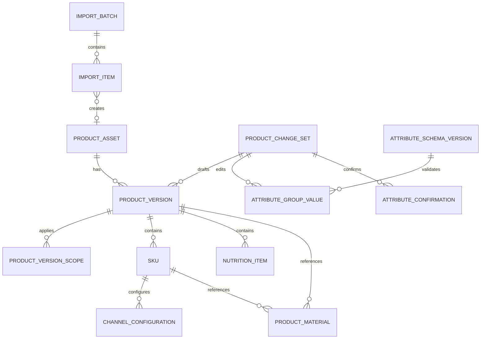

# TRD 02：产品档案、版本与存量迁移

版本：V0.1

日期：2026-06-30

状态：已确认基线

基线确认日期：2026-07-02

上游文档：

- `../prd/02-product-profile-version-migration-prd.md`
- `00-system-master-trd.md`
- `01-opportunity-case-project-trd.md`

## 1. 范围与非目标

本文设计产品资产、产品版本、SKU、渠道配置、可配置属性组、档案草稿、专业确认、原子发布和存量产品迁移。

不替代ERP、MES、WMS的物料、生产、库存或交易主数据，不实现产品自动合并，不允许通过普通档案编辑绕过产品迭代流程改变已发布事实。

## 2. 模块与依赖

- `products`：产品资产、版本、SKU、渠道配置、草稿和发布；
- `configuration`：属性组、字段和字典的版本化定义；
- `documents`：营养标签、包装素材及受控文件版本；
- `work_items`：属性组专业确认；
- `projects`：草稿来源项目或产品变更项目；
- `integrations`：外部编码和数据来源；
- `authorization`、`audit`：字段权限和发布审计。

`products`是产品定义和生命周期事实的权威写模型。外部执行事实仅以绑定或快照形式保存。

## 3. 领域模型



### 3.1 模型原则

- `ProductAsset`表示长期产品身份；
- `ProductVersion`表示核心产品定义；
- `SKU`必须属于具体产品版本；
- `ChannelConfiguration`是SKU在渠道下的带时间版本配置；
- `ProductChangeSet`统一承载新品草稿、老品迭代草稿和存量导入基线；
- 已发布对象不可原位修改；
- 多个版本可并行有效，但适用范围和时间不得冲突；
- 固定核心字段使用实体列，可配置字段使用版本化属性组值；
- 高频检索和统计字段不得隐藏在任意JSON中。

## 4. 表设计

以下省略总TRD通用字段。

### 4.1 `products_product_asset`

| 字段 | 类型 | 说明 |
|---|---|---|
| `business_no` | varchar(32) | 组织内唯一产品编号 |
| `name` | varchar(200) | 当前展示名称 |
| `brand_id` | bigint | 品牌字典 |
| `category_id` | bigint | 品类字典 |
| `product_owner_id` | bigint | 产品负责人 |
| `source_type` | varchar(24) | NEW_PROJECT/LEGACY_IMPORT |
| `lifecycle_status` | varchar(24) | DEVELOPING/ACTIVE/SUSPENDED/RETIRED |
| `primary_version_id` | bigint | 默认展示版本，可空 |
| `source_project_id` | bigint | 新品来源项目，可空 |
| `retired_at` | datetime | 退市时间，可空 |

索引：

- 唯一：`organization_id, business_no`；
- 普通：`organization_id, lifecycle_status, category_id`；
- 普通：`name`、`brand_id`、`product_owner_id`。

`primary_version_id`只用于默认展示，不代表同一时间只能有一个有效版本。

### 4.2 `products_product_version`

| 字段 | 类型 | 说明 |
|---|---|---|
| `product_id` | bigint | 产品资产 |
| `version_code` | varchar(40) | 产品内唯一版本号 |
| `version_name` | varchar(120) | 展示名称 |
| `status` | varchar(24) | DRAFT/PENDING_CONFIRMATION/APPROVED_PENDING_EFFECTIVE/EFFECTIVE/INACTIVE |
| `change_set_id` | bigint | 来源草稿，可空 |
| `supersedes_version_id` | bigint | 被替代版本，可空 |
| `definition_summary` | text | 产品定义摘要 |
| `shelf_life_value` | decimal(10,2) | 保质期数值 |
| `shelf_life_unit` | varchar(16) | DAY/MONTH等 |
| `storage_condition` | text | 储存条件 |
| `standard_code` | varchar(80) | 执行标准 |
| `effective_from`、`effective_to` | datetime | 生效区间 |
| `approval_basis_type`、`approval_basis_id` | varchar/bigint | 阶段门或产品总监批准 |
| `published_at`、`published_by` | datetime/bigint | 发布信息 |

唯一：`product_id, version_code`。有效版本不能物理删除。

### 4.3 `products_product_version_scope`

| 字段 | 说明 |
|---|---|
| `product_version_id` | 产品版本 |
| `scope_type` | GLOBAL/CHANNEL |
| `channel_id` | CHANNEL时必填 |
| `valid_from`、`valid_to` | 有效区间 |
| `status` | PLANNED/EFFECTIVE/ENDED |

应用服务在发布时校验同一产品、同一范围的有效区间不冲突。GLOBAL与CHANNEL同时存在时，CHANNEL明确覆盖GLOBAL默认范围，并在档案中显示。

### 4.4 `products_sku`

| 字段 | 类型 | 说明 |
|---|---|---|
| `product_version_id` | bigint | 所属版本 |
| `sku_code` | varchar(40) | 内部SKU编号 |
| `name` | varchar(200) | SKU名称 |
| `specification` | varchar(160) | 规格 |
| `net_content_value` | decimal(14,4) | 净含量 |
| `net_content_unit` | varchar(20) | 单位 |
| `sales_unit` | varchar(40) | 售卖单位 |
| `inner_packaging`、`outer_packaging` | text | 包装形式 |
| `case_pack_relation` | varchar(100) | 箱规 |
| `barcode` | varchar(64) | 条码或拟定条码 |
| `status` | varchar(20) | DRAFT/ACTIVE/INACTIVE |
| `effective_from`、`effective_to` | datetime | 有效区间 |
| `supersedes_sku_id` | bigint | 来源SKU，可空 |

唯一性：

- `organization_id, sku_code`；
- 非空正式条码在组织内唯一；
- 同一版本内SKU名称与规格组合建立普通索引。

### 4.5 `products_channel_configuration`

| 字段 | 说明 |
|---|---|
| `sku_id` | SKU |
| `channel_id` | 渠道 |
| `configuration_version` | SKU与渠道内递增 |
| `suggested_retail_price` | 定点金额 |
| `channel_selling_points` | 渠道卖点 |
| `channel_status` | PLANNED/ON_SALE/SUSPENDED/OFF_SALE |
| `valid_from`、`valid_to` | 生效区间 |
| `supersedes_config_id` | 前一配置 |
| `change_set_id` | 来源草稿 |

唯一：`sku_id, channel_id, configuration_version`。发布时校验同一SKU与渠道的生效区间不重叠。

### 4.6 `products_product_change_set`

| 字段 | 类型 | 说明 |
|---|---|---|
| `change_type` | varchar(24) | NEW_PRODUCT/ITERATION/LEGACY_BASELINE/CORRECTION |
| `product_id` | bigint | 新品初始化后也有产品ID |
| `project_id` | bigint | 项目来源，可空 |
| `migration_batch_id` | bigint | 导入来源，可空 |
| `base_version_id` | bigint | 老品迭代基线，可空 |
| `base_fingerprint` | char(64) | 基线快照摘要 |
| `status` | varchar(24) | DRAFT/IN_CONFIRMATION/APPROVED/PUBLISHED/REJECTED |
| `change_scope` | json | VERSION/SKU/CHANNEL及目标ID清单 |
| `completeness_status` | varchar(24) | COMPLETE/PARTIAL/NEEDS_SUPPLEMENT |
| `approval_basis_type`、`approval_basis_id` | varchar/bigint | 批准依据 |
| `published_at` | datetime | 发布时间 |

同一项目可有多个技术草稿版本，但同一批准范围只能有一个已发布变更集。

### 4.7 属性模板与属性值

`configuration_attribute_schema_version`：

- `schema_code`、`version_number`、`applicable_category_id`；
- `status`：DRAFT/PUBLISHED/RETIRED；
- `published_at`；
- 发布后不可修改。

`configuration_attribute_group_definition`：

- 所属Schema版本；
- 组代码、名称、归属层级PRODUCT/VERSION/SKU/CHANNEL；
- 负责部门、是否关键、是否要求确认、敏感等级、显示顺序。

`configuration_attribute_definition`：

- 字段代码、类型、必填、字典、校验规则、敏感等级；
- 是否可搜索；
- 搜索字段首期仅允许映射到已批准的结构化索引，不动态创建任意数据库列。

`products_attribute_group_value`：

| 字段 | 说明 |
|---|---|
| `change_set_id` | 草稿时所属变更集，可空 |
| `owner_type`、`owner_id` | PRODUCT/VERSION/SKU/CHANNEL及对象 |
| `group_definition_id` | 属性组定义 |
| `schema_version_id` | 使用的模板版本 |
| `values_json` | 经Schema校验的值 |
| `content_hash` | 规范化值摘要 |
| `value_status` | DRAFT/EFFECTIVE/INACTIVE |

固定字段仍写入实体列；属性JSON不得复制产品名称、状态、条码、价格等核心字段作为权威值。

### 4.8 营养成分

`products_nutrition_table`保存产品版本、适用基准（每100g/100ml等）、来源方式、确认状态和标签文件版本。

`products_nutrition_item`保存营养素字典、含量、单位、NRV%、检测/计算来源和显示顺序。

结构化营养表生成规范化摘要，与标签文件经确认的摘要比较；不一致时发布检查失败，不尝试自动改写。

### 4.9 文件素材

`products_product_material`：

- `owner_type`、`owner_id`；
- `material_type`：INNER_PACKAGING/OUTER_PACKAGING/LABEL/DESIGN_SOURCE/CHANNEL_IMAGE/APPROVED_PRINT等；
- `document_version_id`；
- `purpose`、`sensitivity_level`；
- `material_status`：DRAFT/APPROVED/INACTIVE；
- `valid_from`、`valid_to`；
- `confirmation_id`。

同一素材修订绑定新文件版本并创建新素材版本，不覆盖原记录。

### 4.10 属性组确认

`products_attribute_confirmation`：

- `change_set_id`；
- `group_value_id`；
- `content_hash`；
- `confirmer_id`；
- `decision`：APPROVED/RETURNED；
- `comment`、`confirmed_at`；
- `superseded_at`。

属性组内容变化导致`content_hash`变化，原确认自动失效并重新进入待确认。

### 4.11 外部绑定

`integrations_external_binding`保存：

- `source_system`、`object_type`、`external_id`；
- `internal_object_type`、`internal_object_id`；
- `source_timestamp`、`last_synced_at`；
- `binding_status`。

唯一：`source_system, object_type, external_id`。同一有效外部标识不得绑定多个内部对象。

### 4.12 导入批次

`products_import_batch`保存文件版本、模板版本、状态、总数、成功、失败、跳过、创建、关联和操作人。

`products_import_item`保存行号、原始行摘要、校验结果、重复候选、处理决策、目标对象和错误码。原始敏感内容按数据等级限制访问。

## 5. 状态机

### 5.1 产品资产

```text
DEVELOPING → ACTIVE → SUSPENDED → ACTIVE
                    └──────────→ RETIRED
```

新品立项创建`DEVELOPING`；首次上市发布后进入`ACTIVE`；退市只能通过04领域的重大阶段门进入`RETIRED`。

### 5.2 产品版本

```text
DRAFT → PENDING_CONFIRMATION → APPROVED_PENDING_EFFECTIVE → EFFECTIVE → INACTIVE
             ↑ RETURNED ───────────────┘
```

批准与生效时间可不同。定时任务只激活已经具备批准依据且到达生效时间的版本，不能代替业务批准。

### 5.3 变更集

| 当前状态 | 命令 | 目标状态 |
|---|---|---|
| DRAFT | submit_confirmation | IN_CONFIRMATION |
| IN_CONFIRMATION | return_for_edit | DRAFT |
| IN_CONFIRMATION | approve | APPROVED |
| APPROVED | publish | PUBLISHED |
| DRAFT/IN_CONFIRMATION | reject | REJECTED |

重新编辑已确认属性组只使对应确认失效；关键组存在失效确认时不能批准。

## 6. 草稿创建与差异

### 6.1 新品

01领域立项事务创建：

- `ProductAsset(DEVELOPING)`；
- `ProductChangeSet(NEW_PRODUCT)`；
- `ProductVersion(DRAFT)`；
- 已发布属性Schema版本快照；
- 项目、产品和变更集来源关系。

### 6.2 老品迭代

创建`ProductChangeSet(ITERATION)`并保存：

- 当前产品和适用版本；
- 基线版本ID；
- 基线固定字段和属性组摘要；
- `base_fingerprint`；
- 拟变更版本、SKU和渠道范围。

只克隆实际需要编辑的对象。未变更对象通过引用保持，不复制整棵产品树。

### 6.3 差异算法

差异服务将草稿与`base_fingerprint`对应快照比较，输出：

- 对象新增、修改、停用；
- 固定字段旧值和新值；
- 属性组字段旧值和新值；
- 文件版本变化；
- 编辑人和时间；
- 确认状态；
- 关联交付物。

差异按字段稳定代码比较，不按显示名称比较。敏感旧值和新值继续执行字段权限。

## 7. 专业确认

- 只有已发布Schema标记为关键且要求确认的属性组进入确认；
- 默认确认人为模板配置的部门负责人，产品总监或项目组长可调整并留痕；
- 确认绑定`group_value_id + content_hash`；
- 退回后变更集回到可编辑状态；
- 内容变化时原确认标记失效；
- 文件属性确认同时绑定具体`document_version_id`；
- 产品总监批准不能替代缺失的关键专业确认，除非存在03领域定义的有效豁免依据。

## 8. 发布前检查

`ValidateProductPublication`返回结构化阻塞项：

- 核心固定字段完整；
- Schema必填属性完整且类型有效；
- 关键属性组确认有效；
- 营养结构化值与确认标签一致；
- 正式素材引用ACTIVE且锁定的文件版本；
- SKU条码、外部编码和对象引用无冲突；
- 版本及渠道适用范围不重叠；
- 基线指纹未变化；
- 批准依据有效且对应当前草稿内容；
- 生效时间合理；
- 权限和组织范围一致。

检查结果仅供当前版本使用；发布事务内必须重新检查。

## 9. 原子发布

`PublishProductChangeSet`：

1. 锁定产品、变更集、受影响版本和渠道范围；
2. 校验幂等键和变更集尚未发布；
3. 重新执行发布前检查；
4. 创建或激活新产品版本、SKU和渠道配置；
5. 设置被替代记录的结束时间，但不覆盖历史值；
6. 创建属性组有效快照和素材有效关系；
7. 写入适用范围、生效时间和批准依据；
8. 更新产品默认展示版本和生命周期状态；
9. 将变更集置为`PUBLISHED`；
10. 写入审计及领域事件发件箱。

数据库写入在同一事务内完成。文件已在`documents`模块中成为ACTIVE受控版本，发布只建立不可变引用，不在事务内复制大文件。

发布唯一键为`change_set_id`。重复调用返回已发布结果。

## 10. 并行有效与冲突处理

- 发布时按产品、scope和有效区间检查冲突；
- 同一渠道可以明确使用不同产品版本，但同一时段只能有一个优先有效配置；
- 无渠道范围的GLOBAL版本作为默认；
- 产品档案默认显示`primary_version_id`，同时展示其他有效范围；
- 老品项目提交发布时若当前基线指纹变化，返回`PRODUCT_BASELINE_CHANGED`；
- 项目组必须重新比较并选择：重做草稿基线、保留非冲突变更或撤回；
- 系统不自动把两个项目的草稿合并。

## 11. 存量产品迁移

### 11.1 流程

```text
上传 → 解析 → 字段校验 → 重复识别 → 人工处理
→ 预览 → 确认导入 → 建立基线草稿 → 补充 → 产品总监发布
```

### 11.2 导入策略

- 文件先进入受控临时版本；
- 解析和校验异步执行；
- 单行失败不阻止其他有效行进入预览；
- 未经确认不创建有效产品事实；
- 确认导入使用行级幂等键`batch_id + row_number`；
- 每行保存创建、关联已有、跳过或失败结果；
- 重复提示不自动合并；
- 部分完整和待补充基线允许发布，但缺失项明确展示。

### 11.3 重复识别

依次生成候选：

1. 外部产品/SKU编码精确匹配；
2. 条码精确匹配；
3. 标准化名称、规格组合；
4. 品牌、品类、净含量组合。

只有精确外部ID或条码冲突可作为阻止项；模糊候选必须由授权人员选择关联、跳过或继续新建。

### 11.4 基线发布

基线使用`ProductChangeSet(LEGACY_BASELINE)`：

- 产品总监一次确认；
- 不创建虚假项目或阶段门；
- 产品直接发布为`ACTIVE`；
- 历史资料标记迁移来源；
- 发布后事实变化必须由迭代项目产生新变更集；
- 补充历史图片、来源说明等非事实信息可通过受控补充命令完成；
- 明显录入错误通过`CORRECTION`变更集由产品总监确认。

## 12. 产品档案查询模型

为避免复杂写模型直接驱动所有页面，`products`提供只读查询服务：

- 产品档案概览；
- 当前及未来有效版本；
- SKU与渠道树；
- 当前有效属性组；
- 营养摘要和包装素材；
- 草稿与有效档案差异；
- 历史版本、项目和批准依据。

首期可使用数据库视图或受控查询对象，不引入独立搜索引擎。搜索字段：

- 产品名称、品牌、品类、状态、负责人；
- 产品编号、SKU编号、条码、外部编码；
- 渠道。

所有搜索先应用对象范围权限，再按字段权限投影结果。

## 13. API设计

| 方法与路径 | 用途 |
|---|---|
| `GET /api/v1/products` | 权限过滤后的产品搜索 |
| `GET /api/v1/products/{id}` | 产品档案概览 |
| `GET /api/v1/products/{id}/versions` | 版本和适用范围 |
| `GET /api/v1/product-versions/{id}/skus` | SKU列表 |
| `GET /api/v1/skus/{id}/channel-configurations` | 渠道配置 |
| `POST /api/v1/product-change-sets` | 创建迭代/修正草稿 |
| `GET/PATCH /api/v1/product-change-sets/{id}` | 查看或编辑草稿 |
| `GET /api/v1/product-change-sets/{id}/diff` | 草稿差异 |
| `POST /api/v1/product-change-sets/{id}/submit-confirmation` | 提交属性确认 |
| `POST /api/v1/attribute-confirmations/{id}/approve` | 确认属性组 |
| `POST /api/v1/attribute-confirmations/{id}/return` | 退回属性组 |
| `POST /api/v1/product-change-sets/{id}/validate-publication` | 发布预检 |
| `POST /api/v1/product-change-sets/{id}/publish` | 原子发布 |
| `POST /api/v1/product-import-batches` | 上传导入文件 |
| `GET /api/v1/product-import-batches/{id}` | 导入进度和结果 |
| `POST /api/v1/product-import-batches/{id}/confirm` | 确认导入草稿 |
| `POST /api/v1/legacy-baselines/{id}/publish` | 产品总监发布基线 |

属性编辑API按属性Schema校验，不允许客户端提交未知字段代码。

## 14. 权限动作

- `product.read_basic`、`read_sensitive`、`search`；
- `product_version.history.read`；
- `product_draft.create`、`edit_group`、`submit`；
- `attribute_group.confirm`、`confirmer.reassign`；
- `product.publish_new`、`publish_iteration`、`publish_baseline`、`correct_baseline`；
- `product_material.preview`、`download_original`；
- `product.export`；
- `external_binding.manage`；
- `migration.upload`、`review`、`confirm`。

产品总监、项目组长和任务R的编辑范围不同。系统管理员可配置Schema，但读取属性值仍需业务权限。

## 15. 并发、幂等与约束

- 草稿编辑使用`version_no`乐观锁；
- 属性组确认以`content_hash`防止确认旧内容；
- 发布锁定产品和受影响scope；
- `change_set_id`保证发布幂等；
- 条码、外部绑定和业务编号由数据库唯一约束兜底；
- 同一导入行使用批次行号幂等；
- 基线指纹变化阻止旧草稿发布；
- 已被决策引用的版本、属性快照和素材不可更新或删除。

## 16. 领域事件与异步任务

领域事件：

- `product.created`；
- `product_change_set.created`；
- `attribute_group.confirmed`；
- `product_version.published`；
- `legacy_baseline.published`；
- `product_lifecycle_status.changed`。

异步任务：

- Excel解析、校验和重复候选生成；
- 发布生效时间到达后的状态激活；
- 产品搜索查询模型刷新；
- 属性确认和发布结果通知；
- 外部编码同步；
- 文件与数据库一致性巡检。

定时激活只处理已批准待生效记录，失败保持原有效档案并告警。

## 17. 审计事件

必须审计：

- 产品、版本、SKU和渠道草稿创建；
- 固定字段及属性组修改；
- 专业确认、退回和确认人调整；
- 发布预检和正式发布；
- 基线变化冲突处理；
- 外部绑定创建、修改和冲突；
- 导入行人工处理决策；
- 产品总监基线发布和录入纠正；
- 敏感字段查看、文件原件下载和批量导出；
- 生命周期状态变化。

## 18. 错误码

| 错误码 | 含义 |
|---|---|
| `ATTRIBUTE_SCHEMA_NOT_PUBLISHED` | 属性模板未发布 |
| `ATTRIBUTE_VALUE_INVALID` | 属性值不符合Schema |
| `ATTRIBUTE_CONFIRMATION_STALE` | 内容变化导致确认失效 |
| `PRODUCT_REQUIRED_FIELD_MISSING` | 核心或必填字段缺失 |
| `NUTRITION_LABEL_MISMATCH` | 结构化营养值与标签不一致 |
| `PRODUCT_MATERIAL_NOT_CONTROLLED` | 素材不是有效受控版本 |
| `PRODUCT_SCOPE_OVERLAP` | 版本或渠道有效范围冲突 |
| `PRODUCT_BASELINE_CHANGED` | 当前有效档案已发生变化 |
| `PRODUCT_CHANGE_ALREADY_PUBLISHED` | 变更集已发布 |
| `BARCODE_ALREADY_BOUND` | 条码已被占用 |
| `EXTERNAL_BINDING_CONFLICT` | 外部标识绑定冲突 |
| `IMPORT_TEMPLATE_UNSUPPORTED` | 导入模板版本不支持 |
| `IMPORT_DUPLICATE_REVIEW_REQUIRED` | 重复候选需要人工处理 |

## 19. 测试设计

### 19.1 模型与发布

- 产品—版本—SKU—渠道关系和唯一约束；
- 固定字段与属性值Schema校验；
- 关键属性变化使确认失效；
- 营养结构化值和标签不一致阻止发布；
- 新品发布一次性激活产品、版本、SKU和渠道；
- 发布任一步失败时有效档案不变；
- 重复发布返回同一结果；
- 多有效版本按scope展示且冲突被阻止；
- 当前基线变化后旧项目草稿不能发布；
- 历史版本和素材保持不可变。

### 19.2 迁移

- 部分完整产品允许进入基线草稿；
- 外部ID和条码精确冲突阻止自动新建；
- 模糊重复只提示不自动合并；
- 单行失败不阻止其他行预览；
- 重复确认同一导入批次不重复创建；
- 产品总监发布后产品可检索；
- 基线发布后事实变化必须走迭代变更集。

### 19.3 权限和查询

- 普通员工只能搜索有权查看的产品；
- 配方、工艺和未上市包装按字段隐藏；
- 系统管理员能配置Schema但看不到敏感值；
- 图片预览、原件下载和导出分别授权；
- 历史版本沿用自身数据等级。

### 19.4 并发

- 两个项目同时基于同一版本编辑，先发布后使另一草稿发生基线冲突；
- 两个并发发布只有一个成功；
- 同一外部编码并发绑定由唯一约束阻止；
- 属性确认和字段编辑并发时旧确认失效。

## 20. 需求追踪

| 需求 | 技术实现 |
|---|---|
| PIM-001 | 产品、版本、SKU、渠道配置关系表 |
| PIM-002 | 固定列与版本化属性Schema/值 |
| PIM-003 | 营养表、明细和标签文件校验 |
| PIM-004 | 产品素材与受控文件版本引用 |
| PIM-005 | 变更集、基线指纹和字段差异服务 |
| PIM-006 | 内容哈希绑定的属性组确认 |
| PIM-007 | `PublishProductChangeSet`原子事务 |
| PIM-008 | 版本scope与生效区间 |
| PIM-009 | 权限过滤的产品档案查询服务 |
| PIM-010 | 表单和Excel导入批次 |
| PIM-011 | 分层重复识别和导入结果 |
| PIM-012 | `LEGACY_BASELINE`及产品总监发布 |
| PIM-013 | 外部绑定、来源和同步时间 |
| PIM-014 | 字段、属性组和文件动作权限 |

## 21. 未决项

无阻塞实施的架构未决项。具体属性组字段、品类模板、字典值和首批外部系统映射作为版本化配置维护。
