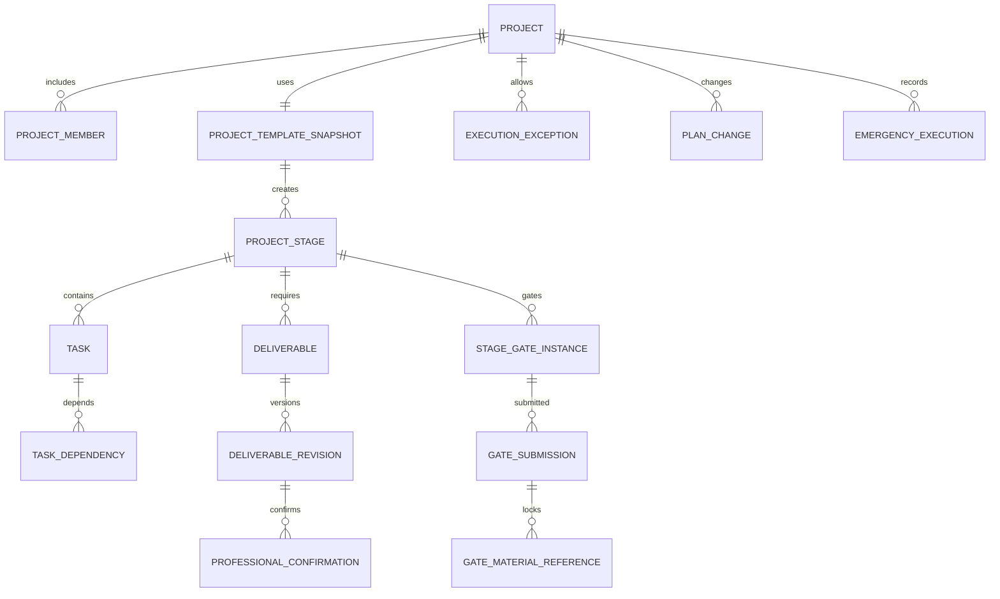

# TRD 03：开发—上市项目执行

版本：V0.1

日期：2026-06-30

状态：已确认基线

基线确认日期：2026-07-02

上游文档：

- `../prd/03-development-launch-execution-prd.md`
- `00-system-master-trd.md`
- `01-opportunity-case-project-trd.md`
- `02-product-profile-version-migration-trd.md`

## 1. 范围与非目标

本文设计立项通过后的项目初始化、模板快照、阶段、任务、交付物、专业确认、阶段门、首次上市、计划调整、逾期和在途项目迁移。

不把默认专业模板固化为不可修改代码，不建设通用BPM设计器，不自动处罚或冻结逾期项目，不在钉钉内改变业务状态。

## 2. 模块与依赖

- `projects`：项目、项目成员、阶段和计划；
- `configuration`：项目模板、责任模板及版本；
- `work_items`：任务、交付物和专业确认；
- `stage_gates`：阶段门提交、检查、决策和例外；
- `products`：产品档案草稿和发布；
- `documents`：受控交付物版本；
- `operations`：上市后运营监控初始化；
- `authorization`、`audit`、`notifications`：权限、审计和提醒。

项目初始化由01领域的立项通过事务调用，初始化服务自身必须幂等。

## 3. 领域模型



### 3.1 聚合边界

- `Project`拥有成员、当前阶段和总体状态；
- `ProjectStage`拥有执行策略和阶段状态；
- `Task`独立维护执行状态和个人R；
- `Deliverable`拥有受控版本和专业确认；
- `StageGateInstance`拥有提交版本和决策；
- 模板定义与项目快照分离，项目运行只读取快照。

阶段门提交不读取“当前文件”，只读取提交时锁定的材料引用。

## 4. 表设计

### 4.1 `projects_project`

| 字段 | 类型 | 说明 |
|---|---|---|
| `business_no` | varchar(32) | 组织内唯一项目编号 |
| `name` | varchar(200) | 项目名称 |
| `project_type` | varchar(24) | NEW_PRODUCT/PRODUCT_CHANGE |
| `status` | varchar(32) | INITIALIZING/ACTIVE/DEFERRED/PASSED/PUBLISH_PENDING_REPAIR/OPERATING/CLOSED |
| `current_stage_id` | bigint | 当前主阶段 |
| `leader_id` | bigint | 项目唯一A |
| `deputy_leader_id` | bigint | 可空 |
| `product_id` | bigint | 关联产品 |
| `product_change_set_id` | bigint | 当前草稿 |
| `project_candidate_id` | bigint | 来源拟立项方案，唯一 |
| `planned_start_at`、`planned_end_at` | datetime | 总体计划 |
| `actual_start_at`、`actual_end_at` | datetime | 实际时间 |
| `template_snapshot_id` | bigint | 模板快照 |

索引：

- 唯一：`organization_id, business_no`；
- 唯一：`project_candidate_id`；
- 普通：`organization_id, status, current_stage_id`；
- 普通：`leader_id, status`；
- 普通：`product_id, created_at`。

### 4.2 `projects_project_member`

| 字段 | 说明 |
|---|---|
| `project_id`、`user_id` | 项目与用户 |
| `project_role` | LEADER/DEPUTY/MEMBER |
| `department_id` | 当时所属部门 |
| `active_from`、`active_to` | 有效区间 |
| `appointed_by` | 任命人 |

历史成员记录不覆盖。只有一名有效LEADER。

### 4.3 项目模板

`configuration_project_template_version`：

- 模板代码、项目类型、品类范围、版本号、状态；
- 发布后不可修改。

子表：

- `stage_template`：阶段代码、顺序、是否核心、默认计划；
- `task_template`：任务、执行部门、前置任务、是否核心；
- `deliverable_template`：交付物层级、专业确认要求；
- `gate_template`：阶段门类型、检查规则和处理角色；
- `responsibility_template`：主责、执行、协同、知会部门。

### 4.4 `projects_project_template_snapshot`

项目创建时复制完整模板JSON快照及来源模板版本ID、摘要和创建时间。运行表从快照展开，后续模板发布不更新项目。

快照必须保留：

- 阶段、任务、交付物和依赖；
- 部门责任；
- 阶段门和检查规则；
- 不适用预设；
- 默认周期和通知配置。

### 4.5 `projects_project_stage`

| 字段 | 说明 |
|---|---|
| `project_id`、`stage_code` | 项目与阶段 |
| `name`、`sequence_no` | 展示和顺序 |
| `status` | NOT_STARTED/ACTIVE/READY_FOR_GATE/COMPLETED/DEFERRED/PASSED |
| `handling_mode` | EXECUTE/REUSE/SIMPLIFY/EXEMPT/NOT_APPLICABLE/PARALLEL |
| `planned_start_at`、`planned_end_at` | 计划 |
| `actual_start_at`、`actual_end_at` | 实际 |
| `exception_id` | 复用、简化、豁免或并行依据 |

唯一：`project_id, stage_code`。

### 4.6 `work_items_task`

| 字段 | 说明 |
|---|---|
| `project_id`、`stage_id` | 所属项目和阶段 |
| `task_code`、`name`、`description` | 标识与内容 |
| `source_type` | TEMPLATE/PROJECT_CUSTOM |
| `is_core` | 核心任务 |
| `responsible_user_id` | 唯一个人R，可在待分派时为空 |
| `responsible_department_id` | 执行部门 |
| `status` | NOT_STARTED/IN_PROGRESS/BLOCKED/COMPLETED/CANCELLED |
| `planned_start_at`、`planned_due_at` | 计划 |
| `completed_at` | 完成时间 |
| `block_reason` | 阻塞原因 |

同一任务只能有一个有效R。多部门执行拆分为多个任务。

### 4.7 `work_items_task_dependency`

`task_id`、`predecessor_task_id`、`dependency_type`。

唯一：`task_id, predecessor_task_id`。保存前检测有向无环，首期只支持FINISH_TO_START和提示型依赖，不实现复杂排程引擎。

### 4.8 `work_items_deliverable`

| 字段 | 说明 |
|---|---|
| `project_id`、`stage_id` | 所属项目和阶段 |
| `deliverable_code`、`name` | 标识 |
| `tier` | CORE_REQUIRED/TEMPLATE_RECOMMENDED/PROJECT_CUSTOM |
| `status` | NOT_STARTED/DRAFT/SUBMITTED/CONFIRMED/CONTROLLED/EXEMPTED/VOIDED |
| `compiler_task_id` | 编制任务，可空 |
| `requires_professional_confirmation` | 是否专业确认 |
| `current_revision_id` | 当前版本 |
| `planned_due_at` | 计划时间 |

核心必交付物不能删除、取消或VOID，只能通过有效豁免变为`EXEMPTED`。

任务的A和交付物归口负责人均实时取项目当前`leader_id`，不在任务或交付物上复制组长字段。组长更换后新责任立即生效，历史责任通过项目成员有效区间和审计记录还原。

### 4.9 `work_items_deliverable_revision`

| 字段 | 说明 |
|---|---|
| `deliverable_id` | 交付物 |
| `revision_number` | 递增版本 |
| `document_version_id` | 受控文件版本 |
| `status` | DRAFT/SUBMITTED/LOCKED/CONTROLLED/SUPERSEDED |
| `content_hash` | 文件及元数据摘要 |
| `submitted_by`、`submitted_at` | 提交信息 |
| `locked_at` | 被确认或阶段门引用后锁定 |

唯一：`deliverable_id, revision_number`。修订创建新行，不更新旧版本内容。

### 4.10 `work_items_professional_confirmation`

| 字段 | 说明 |
|---|---|
| `deliverable_revision_id` | 确认的具体版本 |
| `confirmer_id` | 部门负责人本人或指定人 |
| `assigned_by` | 默认配置、项目组长或产品总监 |
| `status` | PENDING/APPROVED/RETURNED/SUPERSEDED |
| `comment`、`confirmed_at` | 结果 |

同一版本同一确认职责只有一个有效确认。新交付物版本不继承旧确认。

### 4.11 `stage_gates_stage_gate_instance`

| 字段 | 说明 |
|---|---|
| `project_id`、`stage_id` | 所属项目阶段 |
| `gate_code` | 阶段门代码 |
| `gate_type` | NORMAL/MAJOR |
| `status` | NOT_READY/READY/SUBMITTED/NEEDS_INFO/DEFERRED/PASSED/APPROVED |
| `handler_policy` | 业务负责人/产品总监/重大决策 |
| `current_submission_id` | 当前提交版本 |
| `decision_id` | 最终决策 |

新品L2使用重大阶段门`FIRST_LAUNCH`；普通老品迭代使用非重大`CHANGE_EFFECTIVE`，退市由04领域使用重大阶段门。

### 4.12 `stage_gates_gate_submission`

每次提交生成不可变版本：

- `stage_gate_id`、`submission_number`；
- 任务状态快照；
- 交付物及专业确认快照；
- 产品草稿版本和完整性结果；
- 计划、风险和例外快照；
- 提交人、提交时间；
- 检查结果。

`gate_material_reference`逐项引用具体交付物版本、文件版本、数据快照和产品草稿版本。

### 4.13 `stage_gates_gate_decision`

保存统一结果：

- APPROVED；
- APPROVED_WITH_EXCEPTION；
- NEEDS_INFO；
- DEFERRED；
- PASSED。

普通阶段门保存处理人和说明。重大阶段门额外保存经管会整体结论、老板最终决策及差异。流程结果以老板最终决策为准。

### 4.14 `projects_execution_exception`

统一保存复用、简化、豁免、并行和例外通过说明：

- 项目、阶段/任务/交付物；
- exception_type；
- 项目组长申请；
- 产品总监确认；
- 历史依据或复用对象；
- 当时阻塞项和文件版本；
- 状态及确认时间。

不适用由模板快照产生，不建立项目内任意申请。所有面向用户的阶段门例外统一显示“例外通过说明”。

### 4.15 `projects_plan_change`

保存调整对象、调整类型、前后值、影响判断、提出人、确认人和状态：

- MINOR：项目组长直接生效；
- IMPORTANT：产品总监确认；
- RESOURCE_ESCALATION：产品总监无法协调后上升经管会。

### 4.16 `projects_emergency_execution`

保存总监级“先执行、后补确认”：

- 项目和具体事项；
- 发起人及总监级资格快照；
- 先执行时间；
- 待补内容和截止时间；
- 状态OPEN/COMPLETED/OVERDUE；
- 补确认记录；
- 经管会升级提示时间。

系统不自动回滚现实操作。

### 4.17 在途项目迁移

`projects_migration_baseline`保存来源、当前阶段、负责人、项目组、计划、历史决策摘要、迁移日期、确认人和处理方式CONTINUE/ARCHIVE_ONLY。

历史任务、交付物和文件标记`MIGRATED_HISTORY`，不生成伪造阶段门或专业确认。

## 5. 默认阶段模板

首期发布一份可配置的新品默认模板：

| 代码 | 阶段 |
|---|---|
| D1 | 项目启动与产品定义 |
| D2 | 配方打样与体验验证 |
| D3 | 工艺放大与质量验证 |
| D4 | 工程化与试销准备 |
| D5 | 上市验证/试销 |
| L1 | 正式上市方案 |
| L2 | 首次上市阶段门 |
| L3 | 发布与运营交接 |

具体任务、周期和交付物是模板数据，不写死在领域代码中。D1—L3主干代码和L2重大阶段门语义不可被模板删除。

D5试销A、B、C、D轮作为可选子任务模板，B/C允许并行。每轮记录渠道、范围、时间、指标口径、结果和分支结论。

## 6. 项目初始化

01领域的`ApproveAndCreateProject`先创建项目基础记录和产品草稿，再调用`InitializeProjectRuntime`：

1. 校验项目基础记录、产品草稿及模板版本；
2. 保存模板快照；
3. 展开阶段、任务、依赖、交付物和阶段门；
4. 建立部门责任，待部门负责人指定个人R；
5. 设置D1为活动阶段；
6. 写入审计和发件箱事件。

唯一约束`project_candidate_id`保证重复调用返回同一项目。初始化失败由外层立项事务整体回滚。

## 7. 阶段与任务执行

### 7.1 阶段状态

| 当前 | 命令 | 目标 |
|---|---|---|
| NOT_STARTED | activate | ACTIVE |
| ACTIVE | submit_gate | READY_FOR_GATE |
| READY_FOR_GATE | gate_approved | COMPLETED |
| READY_FOR_GATE | needs_info | ACTIVE |
| ACTIVE/READY_FOR_GATE | defer | DEFERRED |
| ACTIVE/READY_FOR_GATE | pass | PASSED |

并行阶段可以同时ACTIVE，但项目必须有一个主当前阶段用于看板排序。

### 7.2 任务状态

```text
NOT_STARTED → IN_PROGRESS → COMPLETED
                   ↕
                BLOCKED
```

`CANCELLED`只适用于非核心项目自定义任务。完成任务前检查必填交付物或完成说明；重新打开已完成任务必须留痕。

任务依赖只阻止明确配置为强依赖的任务启动。提示型依赖只显示风险。

### 7.3 个人R分派

- 执行部门负责人分派或更换本部门R；
- 项目组长可以提出人员建议，但不能绕过部门负责人强制占用跨部门人员；
- R失效或离职后任务进入`UNASSIGNED_REQUIRED`派生状态并标红；
- 换人不改写历史完成记录；
- 项目组长始终是项目唯一A，副组长不是第二A。

## 8. 阶段处理策略

| 策略 | 发起 | 确认 | 技术要求 |
|---|---|---|---|
| REUSE | 项目组长 | 产品总监 | 绑定历史受控版本及仍有效依据 |
| SIMPLIFY | 项目组长 | 产品总监 | 保存减少的任务/深度 |
| EXEMPT | 项目组长 | 产品总监或升级经管会 | 保存豁免对象和说明 |
| NOT_APPLICABLE | 模板 | 无项目内任意修改 | 来自项目类型快照 |
| PARALLEL | 项目组长 | 产品总监 | 校验依赖和资源风险 |

策略变化不删除任务和交付物，只调整其执行要求并保留原状态。变化后重新计算阶段门阻塞项，既有历史确认继续保留，但只有当前要求和当前版本参与提交检查。

## 9. 交付物与专业确认

### 9.1 版本流程

```text
DRAFT → SUBMITTED → LOCKED → CONTROLLED
          ↑ 新修订创建下一版本
```

- 文件上传成功后才能创建交付物修订；
- 提交确认或阶段门后锁定；
- 通过阶段门后标记为受控；
- 作废只改变有效性；
- 当前版本变化不改变历史提交引用。

### 9.2 专业确认

- 仅关键专业交付物启用；
- 默认确认人是对应部门负责人本人，产品总监可指定；
- 产品总监和项目组长可调整确认人，只记录操作留痕；
- 通过或退回均绑定具体修订；
- 新修订必须重新确认；
- 确认人不能确认已经SUPERSEDED或无权限的版本。

## 10. 阶段门提交检查

`ValidateGateSubmission`输出阻塞项和提醒项：

- 核心任务是否完成；
- 核心交付物是否存在受控提交版本或有效豁免；
- 当前交付物版本是否完成专业确认；
- 产品草稿必填和关键属性组是否满足；
- 阶段策略例外是否已确认；
- 项目计划、风险和资源信息是否完整；
- 引用文件版本是否ACTIVE；
- 强任务依赖是否完成；
- 先执行后补确认是否存在阻塞性未补项。

项目组长提交时生成不可变`GateSubmission`。提交后产生的新文件版本不进入本次评审；待补充后必须创建下一提交版本。

## 11. 阶段门决策

### 11.1 普通阶段门

由模板配置的业务负责人或产品总监处理，结果映射：

- 通过/带例外通过：完成当前阶段并激活下一阶段；
- 待补充：返回当前阶段；
- 暂缓推进：项目和阶段进入暂缓；
- Pass：保留项目历史和复议能力。

带例外通过仅限产品总监操作，并保存一条`ExecutionException`。

### 11.2 新品首次上市

`FIRST_LAUNCH`是重大阶段门：

- 经管会整体结论；
- 老板最终决策；
- 决策绑定上市方案、产品草稿、预算、资源和风险快照；
- 不记录个人投票；
- 流程以老板最终决策为准；
- 例外说明不能替代老板决策。

### 11.3 老品普通迭代

`CHANGE_EFFECTIVE`默认由产品总监决策，可按业务判断升级经管会，但不因此创建新的重大阶段门类型。

## 12. 发布与运营交接

首次上市或普通迭代批准后执行`PublishAndHandover`：

1. 锁定项目、阶段门提交和产品变更集；
2. 调用02领域原子发布；
3. 设置实际上市/生效时间；
4. 锁定决策材料；
5. 调用04领域创建运营监控范围；
6. 设置经营监督人；
7. 项目状态进入`OPERATING`；
8. 写入审计和通知事件。

上述MySQL内的产品发布、运营范围创建、项目状态和发件箱写入使用同一数据库事务；通知和外部消息在事务提交后异步执行。

如果产品发布失败：

- 阶段门决策保持不变；
- 项目进入`PUBLISH_PENDING_REPAIR`；
- 当前有效产品档案不变；
- 修复后用同一批准依据和幂等键重试；
- 运营监控不得提前创建为有效状态。

## 13. 计划、逾期与资源

### 13.1 调整判定

`ClassifyPlanChange`按影响判断：

- 不改变交付物、阶段门、跨部门资源、确认人和关键节点：MINOR；
- 任一项受影响：IMPORTANT；
- 产品总监确认无法协调：RESOURCE_ESCALATION。

项目组长可直接应用MINOR。IMPORTANT必须由产品总监确认。系统保存前后值，不自动推断现实资源是否可用。

### 13.2 逾期

定时任务计算：

- 任务逾期；
- 交付物逾期；
- 专业确认逾期；
- 阶段门逾期。

只产生标红、站内待办和钉钉摘要，不修改任务或项目业务状态，不自动升级经管会。

### 13.3 先执行后补确认

- 只有总监级有效角色可创建；
- 必须绑定项目、事项、待补内容和截止时间；
- OPEN持续提醒和标红；
- OVERDUE产生经管会升级提示；
- 补充完成后变为COMPLETED；
- 不自动回滚或冻结现实操作。

## 14. 在途项目迁移

流程：

1. 创建迁移批次；
2. 导入项目、当前阶段、负责人、成员和计划；
3. 导入历史任务、交付物和文件；
4. 保存历史决策摘要；
5. 选择CONTINUE或ARCHIVE_ONLY；
6. 产品总监确认迁移基线；
7. CONTINUE从真实当前阶段创建后续待办。

迁移对象：

- 历史阶段标记`MIGRATED_HISTORY`；
- 不补造阶段门、专业确认或个人操作时间；
- 文件保留原始来源说明；
- 项目初始化只生成当前及后续阶段运行实例；
- 重复批次使用外部项目标识幂等。

## 15. API设计

| 方法与路径 | 用途 |
|---|---|
| `GET /api/v1/projects` | 生命周期项目列表 |
| `GET /api/v1/projects/{id}` | 项目工作台概览 |
| `GET /api/v1/projects/{id}/stages` | 阶段和里程碑 |
| `POST /api/v1/projects/{id}/members` | 项目成员调整 |
| `GET/POST /api/v1/projects/{id}/tasks` | 任务列表和自定义任务 |
| `PATCH /api/v1/tasks/{id}` | 更新任务、计划或状态 |
| `POST /api/v1/tasks/{id}/assign` | 部门负责人分派R |
| `GET/POST /api/v1/projects/{id}/deliverables` | 交付物 |
| `POST /api/v1/deliverables/{id}/revisions` | 上传新修订 |
| `POST /api/v1/deliverable-revisions/{id}/submit-confirmation` | 提交专业确认 |
| `POST /api/v1/professional-confirmations/{id}/approve` | 确认通过 |
| `POST /api/v1/professional-confirmations/{id}/return` | 退回 |
| `POST /api/v1/project-stages/{id}/handling-mode-requests` | 申请阶段策略 |
| `POST /api/v1/stage-gates/{id}/validate` | 阶段门预检 |
| `POST /api/v1/stage-gates/{id}/submissions` | 提交阶段门 |
| `POST /api/v1/stage-gates/{id}/decision` | 普通阶段门决策 |
| `POST /api/v1/stage-gates/{id}/major-decision` | 首次上市重大决策 |
| `POST /api/v1/projects/{id}/plan-changes` | 计划调整 |
| `POST /api/v1/projects/{id}/emergency-executions` | 先执行后补确认 |
| `POST /api/v1/project-migration-batches` | 在途项目迁移 |

## 16. 权限动作

- `project.read`、`plan.edit`、`member.manage`；
- `task.create`、`task.assign_department_member`、`task.update_own`；
- `deliverable.create`、`revision.submit`、`revision.download`；
- `professional_confirmation.decide`、`confirmer.reassign`；
- `stage_handling.request`、`stage_handling.confirm`；
- `stage_gate.submit`、`normal_gate.decide`；
- `first_launch.management_conclusion.record`、`first_launch.final_decision.record`；
- `project_exception.confirm`；
- `plan_change.apply_minor`、`plan_change.confirm_important`；
- `emergency_execution.create`；
- `project_migration.confirm`。

部门参与不自动授予全文或敏感文件权限；个人R按任务和数据等级获得最小必要权限。

## 17. 并发、幂等与约束

- 初始化以`project_candidate_id`幂等；
- 项目只允许一名有效组长；
- 任务只允许一名有效R；
- 任务依赖禁止形成环；
- 交付物修订号唯一递增；
- 专业确认绑定内容哈希和版本；
- 阶段门提交锁定引用版本；
- 阶段门决策只完成一次；
- 发布交接使用阶段门决策和变更集联合幂等键；
- 任务和计划编辑使用`version_no`；
- 新产品草稿字段冲突由02领域基线和乐观锁处理。

## 18. 领域事件与异步任务

领域事件：

- `project.initialized`；
- `task.assigned`、`task.completed`；
- `deliverable.revision_submitted`；
- `professional_confirmation.decided`；
- `stage_gate.submitted`、`stage_gate.decided`；
- `first_launch.approved`；
- `product.publication_pending_repair`；
- `project.entered_operations`；
- `emergency_execution.overdue`。

异步任务：

- 任务、交付物、确认和阶段门逾期扫描；
- 待办与钉钉通知；
- 项目进度汇总；
- 先执行后补确认持续提醒；
- 发布修复提醒；
- 迁移批次解析。

## 19. 审计事件

必须审计：

- 项目初始化和模板版本；
- 项目组长、成员和任务R变化；
- 任务状态、计划和依赖变化；
- 交付物版本提交、锁定、确认和作废；
- 阶段处理策略和依据；
- 阶段门提交、阻塞项、决策和例外；
- 首次上市整体结论和最终决策；
- 普通迭代生效批准；
- 计划调整和资源升级；
- 先执行后补确认；
- 在途项目迁移确认；
- 发布与运营交接。

## 20. 错误码

| 错误码 | 含义 |
|---|---|
| `PROJECT_ALREADY_INITIALIZED` | 项目已经初始化 |
| `PROJECT_TEMPLATE_NOT_PUBLISHED` | 没有可用模板版本 |
| `PROJECT_LEADER_REQUIRED` | 项目唯一A缺失 |
| `TASK_RESPONSIBLE_USER_REQUIRED` | 任务尚未落实个人R |
| `TASK_DEPENDENCY_CYCLE` | 任务依赖形成环 |
| `CORE_TASK_CANNOT_CANCEL` | 核心任务不能直接取消 |
| `CORE_DELIVERABLE_REQUIRES_EXCEPTION` | 核心交付物只能豁免 |
| `DELIVERABLE_REVISION_NOT_ACTIVE` | 文件版本不可用于提交 |
| `PROFESSIONAL_CONFIRMATION_STALE` | 确认不是当前版本 |
| `STAGE_GATE_PRECONDITION_FAILED` | 阶段门存在阻塞项 |
| `STAGE_GATE_ALREADY_DECIDED` | 阶段门已经决策 |
| `STAGE_HANDLING_NOT_CONFIRMED` | 阶段处理策略未确认 |
| `PLAN_CHANGE_REQUIRES_DIRECTOR` | 调整影响重要范围 |
| `EMERGENCY_EXECUTION_ROLE_REQUIRED` | 发起人不是总监级 |
| `PRODUCT_PUBLICATION_FAILED` | 决策通过但档案发布失败 |
| `MIGRATION_BASELINE_NOT_CONFIRMED` | 在途项目基线未确认 |

## 21. 测试设计

### 21.1 初始化和模板

- 同一立项重复触发只创建一个项目；
- 模板快照与后续模板更新隔离；
- 初始化任一步失败由立项事务整体回滚；
- 默认D1—L3阶段和L2重大阶段门存在；
- 老品模板可预设不适用但不能删除统一主干。

### 21.2 任务与责任

- 每个任务只能有一名R；
- 多部门执行通过子任务实现；
- 部门负责人可换人且历史不改写；
- R离职后进入待分派并标红；
- 依赖环被拒绝；
- 核心任务不能直接取消。

### 21.3 交付物和确认

- 三层交付物权限不同；
- 核心必交付物只能豁免；
- 新修订不继承旧专业确认；
- 阶段门继续引用提交时锁定版本；
- 文件上传失败不创建修订。

### 21.4 阶段门和发布

- 缺少核心交付物或确认时提交失败并列出阻塞项；
- 带例外通过只有产品总监可操作；
- 首次上市同时保存经管会结论和老板决策；
- 老板决策与整体结论不一致时按老板结果迁移；
- 发布失败进入`PUBLISH_PENDING_REPAIR`且有效档案不变；
- 重试发布不重复创建版本和运营范围。

### 21.5 调整、逾期和迁移

- 轻微调整由项目组长直接生效；
- 跨部门或关键节点调整要求产品总监；
- 逾期只提醒和标红；
- 非总监级不能发起先执行后补确认；
- 超期只升级提示不自动回滚；
- 在途项目从真实阶段继续且不补造历史决策。

### 21.6 并发

- 两人同时更新任务时旧版本冲突；
- 提交阶段门与上传新修订并发时提交仍绑定原版本；
- 两个并发阶段门决策只有一个完成；
- 两次发布交接只创建一个产品发布和运营范围。

## 22. 需求追踪

| 需求 | 技术实现 |
|---|---|
| EXE-001 | 幂等项目初始化和模板快照 |
| EXE-002 | D1—L3默认模板数据 |
| EXE-003 | 责任模板、项目成员和唯一个人R |
| EXE-004 | 任务状态、DAG依赖、计划和逾期扫描 |
| EXE-005 | 三层交付物和不可变修订 |
| EXE-006 | 绑定具体修订的专业确认 |
| EXE-007 | 阶段门提交快照、检查和统一结果 |
| EXE-008 | `ExecutionException`及阶段处理策略 |
| EXE-009 | `FIRST_LAUNCH`重大阶段门 |
| EXE-010 | `PublishAndHandover` |
| EXE-011 | `PlanChange`及资源升级 |
| EXE-012 | 异步逾期提醒和查询标红 |
| EXE-013 | `EmergencyExecution` |
| EXE-014 | `MigrationBaseline`及当前阶段续跑 |

## 23. 未决项

无阻塞实施的架构未决项。具体任务、交付物、默认周期、试销轮次和部门责任由版本化模板配置。
