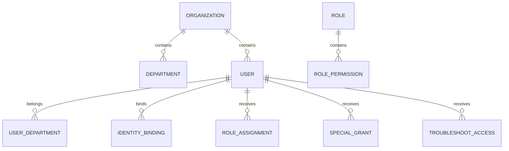
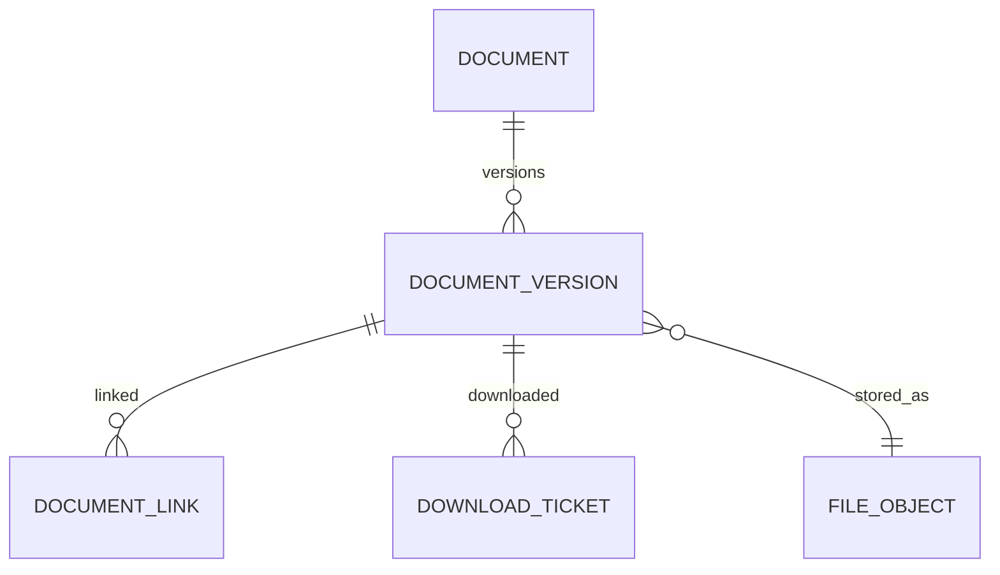

# TRD 05：平台、权限、文件与集成

版本：V0.1

日期：2026-06-30

状态：已确认基线

基线确认日期：2026-07-02

上游文档：

- `../prd/05-platform-permission-file-integration-prd.md`
- `00-system-master-trd.md`
- `01-opportunity-case-project-trd.md`
- `02-product-profile-version-migration-trd.md`
- `03-development-launch-execution-trd.md`
- `04-operations-iteration-retirement-trd.md`

## 1. 范围与非目标

本文设计组织用户、钉钉认证、RBAC + ABAC、关键角色、双人复核、专项授权、配置版本、受控文件、待办通知、审计、集成框架及备份恢复记录。

首期不建设通用策略编程语言、在线文档协作、企业级IAM替代、多租户运营、私有镜像仓库或复杂监控平台。

## 2. 模块边界

- `identity`：组织、用户和钉钉绑定；
- `authorization`：角色、动作、专项授权和权限决策；
- `configuration`：配置草稿、发布版本和引用快照；
- `documents`：文件对象、版本、业务关联和下载票据；
- `notifications`：待办、站内通知、钉钉投递；
- `audit`：不可变审计事件；
- `integrations`：适配器、同步任务、批次和凭据引用；
- `platform`：运行检查、备份和恢复验证记录。

业务模块定义资源和动作语义，`authorization`统一执行判定。平台管理员权限不隐式绕过业务模块。

平台管理权与业务数据访问权是两套独立授权：拥有账号、配置、集成和运行管理能力，不代表可以读取产品配方、成本、供应商、工艺或重大决策材料。

## 3. 身份与组织模型



### 3.1 `identity_organization`

首期只有一个活动企业组织。表保留`public_id`、名称、状态和配置，不实现租户计费或自助开通。

### 3.2 `identity_department`

| 字段 | 说明 |
|---|---|
| `organization_id` | 企业 |
| `parent_id` | 上级部门，可空 |
| `department_code`、`name` | 稳定标识和名称 |
| `status` | ACTIVE/INACTIVE |
| `external_dingtalk_id` | 钉钉部门标识，可空 |
| `valid_from`、`valid_to` | 有效区间 |

部门历史不物理删除。

### 3.3 `identity_user`

| 字段 | 说明 |
|---|---|
| `organization_id` | 企业 |
| `employee_no` | 内部工号，可空但唯一 |
| `display_name` | 当前显示名 |
| `status` | PENDING/ACTIVE/DISABLED/DEPARTED |
| `primary_department_id` | 主部门 |
| `activated_at`、`disabled_at`、`departed_at` | 状态时间 |

历史业务记录始终引用内部用户ID，不使用姓名或钉钉ID作为外键。

### 3.4 `identity_user_department`

保存主部门和兼任部门及有效区间。组织同步只调整当前关系，不改写历史项目、确认或决策中的部门快照。

### 3.5 `identity_identity_binding`

| 字段 | 说明 |
|---|---|
| `user_id` | 内部用户 |
| `provider` | DINGTALK |
| `provider_tenant_id`、`provider_user_id` | 外部身份 |
| `status` | ACTIVE/REVOKED |
| `last_authenticated_at`、`last_synced_at` | 时间 |

唯一：`provider, provider_tenant_id, provider_user_id`。

## 4. 钉钉认证

登录流程：

1. 浏览器进入内网HTTPS域名；
2. 跳转钉钉企业内部应用认证；
3. 回调校验`state`、授权码和企业身份；
4. 查找有效身份绑定；
5. 校验内部用户为ACTIVE；
6. 建立Django服务端会话；
7. 记录登录审计并跳转原目标。

约束：

- 回调地址固定白名单；
- `state`一次性且短时有效；
- 无匹配用户时不自动授予任何关键角色；
- 用户停用或离职后即使钉钉认证成功也拒绝登录；
- 深链接不携带长期凭据；
- 进入深链接后重新执行对象权限判断；
- 组织同步失败不阻止已有有效用户登录，但显示同步异常。

## 5. RBAC模型

### 5.1 表

`authorization_role`：

- `role_code`、名称、角色类型PLATFORM/BUSINESS；
- 是否关键角色；
- 状态。

`authorization_permission_action`：

- `action_code`；
- 资源类型；
- 动作类别READ/WRITE/DECIDE/ADMIN/EXPORT。

`authorization_role_permission`：

- 角色、动作；
- 最大数据等级；
- 是否要求对象范围。

`authorization_role_assignment`：

- 用户、角色；
- 作用域类型ORGANIZATION/DEPARTMENT/PRODUCT_SET；
- 作用域ID；
- 生效和失效时间；
- 配置人；
- 批准记录；
- 状态。

项目组长、任务R和专业确认人等项目身份来自业务表，不重复创建长期全局角色分配。

### 5.2 关键角色

以下角色只允许管理员按批准名单人工配置：

- 超级管理员；
- 系统管理员；
- 产品总监；
- 经管会成员；
- 老板/最终决策人；
- 经营监督人；
- 其他配置为关键的决策角色。

钉钉岗位、部门或职级只作为参考属性，不自动生成关键角色。

## 6. ABAC与权限决策

### 6.1 安全上下文

资源查询服务为权限引擎提供：

- `organization_id`；
- 资源类型和ID；
- 当前阶段和状态；
- 产品、项目和部门范围；
- 数据敏感等级；
- 提案组、项目成员、任务R、确认人、阶段门处理人等关系；
- 文件动作和字段代码；
- 当前时间。

### 6.2 判定顺序

`Authorize(subject, action, resource, context)`：

1. 用户已认证且状态ACTIVE；
2. 用户与资源属于同一组织；
3. 用户拥有允许该动作的有效全局角色、业务角色或对象身份；
4. 角色/身份作用域包含目标对象；
5. 用户允许的数据等级覆盖资源等级；
6. 字段、文件、下载、导出或通知动作满足附加策略；
7. 若常规权限不足，检查有效专项授权或排障访问；
8. 任一步不满足即拒绝。

首期策略由代码中的受控策略函数实现，配置只提供角色、范围、数据等级和业务参数，不允许管理员输入任意表达式执行。

### 6.3 列表与字段

- 列表查询在数据库层按组织和对象范围过滤；
- 高敏字段使用序列化字段策略二次投影；
- 无权对象统一返回404式不可见结果，避免泄露存在性；
- 权限缓存只保存短期派生结果；
- 角色、成员、授权或状态变化后使相关缓存失效；
- 写命令在事务中重新判权，不能依赖前端按钮或旧缓存。

### 6.4 数据等级

固定等级：

1. PUBLIC_SUMMARY；
2. INTERNAL；
3. PROJECT_CONTROLLED；
4. SENSITIVE_CONTROLLED；
5. HIGHLY_SENSITIVE。

等级只是权限输入，不自动授予访问。用户仍需具备对应资源动作和对象范围。

## 7. 超级管理员双人复核

`platform_security_setting`保存`dual_control_enabled`及配置版本。

`authorization_admin_change_request`保存：

- 动作类型；
- 目标账号、角色或关键配置；
- 提出人；
- 变更前后值摘要；
- 状态PENDING/APPROVED/REJECTED/APPLIED/EXPIRED；
- 复核人和时间；
- 到期时间。

规则：

- 开关关闭时，指定超级管理员可单人执行关键平台动作；
- 开关开启时，关键动作先创建请求，不立即生效；
- 复核人不能与提出人相同；
- 两人均必须具备有效复核权限；
- 复核时重新校验目标状态，基线变化则请求失效；
- 开关变更本身始终审计；
- 双人复核只管平台管理，不代替阶段门或产品发布审批。

首期关键平台动作至少包括超级管理员变更、关键角色授权、排障访问开启和双人复核开关变更。

## 8. 专项授权与排障访问

### 8.1 `authorization_special_grant`

| 字段 | 说明 |
|---|---|
| `grantee_id` | 被授权人 |
| `resource_type`、`resource_id` | 对象或明确范围 |
| `actions` | 允许动作集合 |
| `max_sensitivity_level` | 最高等级 |
| `valid_from`、`valid_to` | 有效期 |
| `grantor_id` | 授权人 |
| `status` | PENDING/ACTIVE/EXPIRED/REVOKED |
| `purpose` | 授权用途 |

授权创建时对授权人执行相同资源、动作和数据等级判定，不能越权转授。

### 8.2 `authorization_troubleshoot_access`

排障访问必须绑定：

- 平台人员；
- 具体对象或最小范围；
- 必需动作；
- 数据等级；
- 开始和到期时间；
- 开启人；
- 排障用途。

排障期间所有敏感查看、下载和导出单独审计。到期任务只是补充保障，每次请求仍实时比较`valid_to`。

## 9. 配置中心

### 9.1 通用版本模型

`configuration_definition`保存配置类型和稳定代码。

`configuration_version`保存：

- 版本号；
- 状态DRAFT/PUBLISHED/RETIRED；
- 内容JSON或对应结构化子表；
- 内容摘要；
- 适用范围；
- 创建人、业务确认人、发布时间。

发布后不可修改。已被项目或决策引用的配置不能删除，只能停用。

### 9.2 发布流程

```text
DRAFT → VALIDATING → PUBLISHED → RETIRED
        └─ FAILED并保留上一发布版本
```

发布前：

- Schema和引用完整性校验；
- 显示与当前版本差异；
- 显示影响的新建对象范围；
- 业务配置由产品总监或指定业务管理员确认；
- 平台结构由系统管理员维护。

新项目引用发布版本并创建快照。模板主动升级必须创建差异预览和产品总监确认记录；首期不做批量自动升级。

## 10. 受控文件模型



### 10.1 `documents_file_object`

表示物理文件：

- `storage_backend`：NAS_NFS；
- `object_key`：UUID路径；
- `size_bytes`；
- `sha256`；
- `detected_mime_type`；
- `storage_status`：PENDING/ACTIVE/MISSING/QUARANTINED；
- `created_at`。

对象键不含用户原文件名。相同哈希首期不自动跨权限去重，避免复杂引用和删除风险。

### 10.2 `documents_document`

表示逻辑文档：

- 业务文档编号；
- 标题和分类；
- 来源PROJECT/PRODUCT/MIGRATION/INTEGRATION；
- 默认敏感等级；
- 当前版本；
- 状态ACTIVE/VOIDED/ARCHIVED。

### 10.3 `documents_document_version`

| 字段 | 说明 |
|---|---|
| `document_id`、`version_number` | 版本链 |
| `file_object_id` | 物理对象 |
| `original_filename` | 原文件名 |
| `declared_mime_type`、`detected_mime_type` | 类型 |
| `status` | DRAFT/SUBMITTED/LOCKED/CONTROLLED/RETURNED/VOIDED |
| `sensitivity_level` | 版本自身等级 |
| `uploaded_by`、`uploaded_at` | 上传信息 |
| `submitted_at`、`locked_at`、`controlled_at` | 状态时间 |
| `supersedes_version_id` | 前一版本 |

唯一：`document_id, version_number`。锁定或受控版本内容不可变。

### 10.4 `documents_document_link`

将具体文档版本关联到项目、交付物、产品版本、属性组、阶段门、数据快照或迁移批次。历史决策链接不能改指向新版本。

## 11. 文件上传与一致性

流程遵循总TRD：

1. API创建一次性上传会话；
2. 流式写入NAS临时目录，同时计算SHA-256和大小；
3. 校验非空、大小上限、扩展名、声明MIME和检测MIME；
4. MySQL创建PENDING文件对象和DRAFT文档版本；
5. 文件原子移动到UUID正式路径；
6. 标记文件对象ACTIVE；
7. 关联业务对象；
8. 失败进入补偿并清理临时文件。

约束：

- Django不把整个文件读入内存；
- 同名上传创建新文档或新版本，不自动覆盖；
- 文件类型白名单和大小按配置版本执行；
- 首期不承诺内容杀毒或Office转码，压缩包和高风险类型可按配置禁止；
- 只有ACTIVE文件对象可进入提交、确认或阶段门；
- 定时巡检PENDING超时、MISSING和孤立临时文件；
- 已进入正式版本链的文件不得由巡检自动删除。

## 12. 文件访问

### 12.1 预览和下载

访问流程：

1. 用户请求预览或下载；
2. 后端判断对象、字段、文件动作和版本等级；
3. 创建短时、单用途下载票据；
4. Nginx内部受控路径从NAS流式返回；
5. 记录成功或失败审计。

NAS目录不直接暴露。下载票据到期或专项授权到期后失效。

预览不等于下载授权。首期只对浏览器可安全展示的图片/PDF提供内嵌预览；其他类型下载或由客户端打开，不部署常驻转码服务。

### 12.2 分享和导出

- 分享只创建系统内对象链接；
- 接收人进入后重新判权；
- 通知不附文件；
- 批量导出先判定每个对象和字段；
- 无权限项默认从导出中剔除并给出汇总，不把敏感值写入临时包；
- 高敏导出需要独立动作权限；
- 导出临时文件短期自动清理。

## 13. 待办模型

### 13.1 `notifications_todo`

| 字段 | 说明 |
|---|---|
| `assignee_id` | 处理人 |
| `todo_type` | 补充、任务、确认、阶段门、回看、议题、复核等 |
| `source_type`、`source_id` | 来源对象 |
| `action_code` | 需要执行的动作 |
| `status` | OPEN/COMPLETED/CANCELLED/EXPIRED |
| `due_at` | 截止时间 |
| `dedup_key` | 去重键 |
| `deep_link` | 系统内部路由 |

唯一活动键：`assignee_id, dedup_key, status=OPEN`由应用服务和约束共同保证。

待办是权威入口；业务状态变化通过领域事件创建、更新或关闭待办。

## 14. 站内与钉钉通知

`notifications_notification`保存接收人、模板版本、权限过滤后的摘要、对象、状态和创建时间。

`notifications_delivery`保存渠道IN_APP/DINGTALK、尝试次数、状态、错误码、下次重试时间和外部消息ID。

流程：

1. 消费领域事件；
2. 为每个接收人重新计算通知权限；
3. 生成最小必要摘要和系统深链接；
4. 站内通知落库；
5. 异步投递钉钉；
6. 失败有限重试并记录；
7. 成功后保存外部消息ID。

业务事务不等待钉钉。通知去重键由事件、接收人和通知类型组成。点击后仍实时判权。

## 15. 审计实现

### 15.1 `audit_audit_event`

| 字段 | 说明 |
|---|---|
| `event_id` | UUID |
| `occurred_at` | UTC时间 |
| `actor_user_id` | 操作人 |
| `acting_roles_snapshot` | 当时角色/项目身份摘要 |
| `action_code` | 稳定动作代码 |
| `resource_type`、`resource_public_id` | 资源 |
| `result` | SUCCESS/FAILURE |
| `before_summary`、`after_summary` | 必要变更摘要 |
| `reason` | 决策或变更说明 |
| `trace_id`、`request_metadata` | 请求关联 |
| `related_snapshot_ids` | 文件、数据和决策引用 |

实现约束：

- 应用账号只允许INSERT和SELECT审计表，不提供UPDATE/DELETE业务方法；
- 关键业务审计与业务事务同库同事务；
- 失败请求记录不含敏感正文；
- 密码、令牌、Cookie、完整文件内容和无关个人信息不得进入审计；
- 普通管理员不能编辑或清理审计；
- 审计保留策略由公司制度配置，但被历史决策引用的记录不得清理。

## 16. 外部集成框架

### 16.1 适配器接口

每个适配器实现：

- `test_connection()`；
- `fetch_or_receive()`；
- `validate()`；
- `map()`；
- `persist_batch()`；
- `retry_failed()`；
- `health_status()`。

领域模块不直接引用第三方SDK。

### 16.2 任务和批次

`integrations_sync_job`保存适配器、调度、游标、状态和凭据引用。

`integrations_sync_run`保存运行时间、批次、数量、状态、错误摘要和重试来源。

错误行进入领域批次表或通用`integration_error_item`，包含可定位但不泄露凭据的信息。

### 16.3 凭据

- 凭据通过环境变量或受限密钥文件注入；
- 数据库只保存凭据引用；
- 日志和错误消息脱敏；
- 测试和生产使用不同凭据；
- 轮换凭据不要求修改业务代码。

## 17. 备份与恢复

### 17.1 备份

- MySQL每日自动备份；
- NAS受控文件每日快照/备份；
- 备份复制到独立存储介质；
- 备份任务记录开始、结束、范围、状态、校验和位置引用；
- 备份失败创建管理员待办和站内告警；
- 生产凭据和密钥按独立安全方式备份，不写入普通文件包。

### 17.2 `platform_backup_run`

保存类型DATABASE/FILES/CONFIG、执行时间、备份范围、状态、大小、校验值、保留到期时间和错误摘要。

### 17.3 `platform_restore_verification`

保存：

- 使用的数据库和文件备份；
- 隔离恢复环境；
- 抽查业务对象和文件数量；
- 数据库记录—文件对象一致性结果；
- 恢复开始、完成和总耗时；
- RPO、RTO结果；
- 执行人、问题和整改状态。

目标：RPO ≤ 24小时，RTO ≤ 24小时。没有恢复验证记录的备份不能作为目标已达成的充分证据。

## 18. 运行看板

首期展示：

- 钉钉组织同步状态；
- 外部集成最近运行和失败；
- Celery任务失败和积压摘要；
- MySQL连接健康；
- Redis可用性；
- NAS挂载、容量和文件巡检；
- 通知失败；
- 最近数据库/文件备份；
- 最近恢复验证。

看板只提供轻量运行状态，不替代服务器监控。敏感错误详情仅授权管理员可见。

## 19. API设计

### 19.1 身份和组织

| 方法与路径 | 用途 |
|---|---|
| `GET /api/v1/auth/dingtalk/start` | 发起认证 |
| `GET /api/v1/auth/dingtalk/callback` | 认证回调 |
| `POST /api/v1/auth/logout` | 退出 |
| `GET /api/v1/me` | 当前用户与权限摘要 |
| `GET /api/v1/admin/users` | 用户管理 |
| `POST /api/v1/admin/users/{id}/roles` | 人工配置角色 |

### 19.2 权限和配置

| 方法与路径 | 用途 |
|---|---|
| `POST /api/v1/admin/permission-checks` | 查看允许/拒绝及策略摘要 |
| `POST /api/v1/admin/special-grants` | 创建专项授权 |
| `POST /api/v1/admin/troubleshoot-access` | 开启排障访问 |
| `POST /api/v1/admin/change-requests/{id}/review` | 双人复核 |
| `GET/POST /api/v1/configurations` | 配置列表和草稿 |
| `POST /api/v1/configurations/{id}/validate` | 校验配置 |
| `POST /api/v1/configurations/{id}/publish` | 发布版本 |

权限检查接口不返回源代码策略、其他用户无关授权或敏感值。

### 19.3 文件

| 方法与路径 | 用途 |
|---|---|
| `POST /api/v1/uploads` | 创建上传会话 |
| `POST /api/v1/uploads/{id}/complete` | 完成并关联文件 |
| `GET /api/v1/documents/{id}` | 文档和版本 |
| `POST /api/v1/documents/{id}/versions` | 上传新版本 |
| `POST /api/v1/document-versions/{id}/submit` | 锁定提交 |
| `POST /api/v1/document-versions/{id}/void` | 作废版本 |
| `POST /api/v1/document-versions/{id}/preview-ticket` | 预览票据 |
| `POST /api/v1/document-versions/{id}/download-ticket` | 下载票据 |

### 19.4 待办、审计和运行

| 方法与路径 | 用途 |
|---|---|
| `GET /api/v1/todos` | 我的待办 |
| `GET /api/v1/notifications` | 站内通知 |
| `GET /api/v1/admin/audit-events` | 审计查询 |
| `GET /api/v1/admin/integration-runs` | 集成运行 |
| `POST /api/v1/admin/integration-runs/{id}/retry` | 重试失败批次 |
| `GET /api/v1/admin/runtime-health` | 运行看板 |
| `GET /api/v1/admin/backups` | 备份记录 |
| `POST /api/v1/admin/restore-verifications` | 记录恢复验证 |

## 20. 权限动作

平台动作至少包括：

- `identity.user.manage`、`identity.organization.sync`；
- `role.assign`、`role.revoke`、`admin_change.review`；
- `special_grant.create`、`revoke`；
- `troubleshoot_access.open`、`close`；
- `configuration.edit`、`validate`、`publish`；
- `document.upload`、`preview`、`download`、`void`；
- `export.create`；
- `notification.read`；
- `audit.read`；
- `integration.configure`、`run`、`retry`；
- `backup.read`、`restore_verification.record`。

业务动作在各领域TRD定义并注册到统一动作目录。

## 21. 并发、幂等与安全约束

- 钉钉身份绑定唯一；
- 关键角色分配使用有效区间且同作用域不重复；
- 双人复核请求只能应用一次；
- 专项授权每次请求实时校验有效期；
- 文件版本号在文档内唯一；
- 完成上传使用上传会话幂等键；
- 下载票据短时、单用途且绑定用户和动作；
- 待办使用去重键；
- 通知投递使用事件和接收人幂等键；
- 集成批次和重试不重复写入领域事实；
- 审计写入失败使关键业务事务失败；
- 配置发布失败保留原发布版本；
- 所有管理写操作使用CSRF、会话和事务内权限复核。

## 22. 领域事件与异步任务

### 22.1 `platform_outbox_event`

| 字段 | 说明 |
|---|---|
| `event_id` | UUID幂等标识 |
| `event_type` | 稳定事件代码 |
| `aggregate_type`、`aggregate_id` | 来源聚合 |
| `payload_json` | 最小必要载荷，不含凭据和文件正文 |
| `occurred_at` | 业务发生时间 |
| `status` | PENDING/PROCESSING/PUBLISHED/FAILED |
| `attempt_count`、`next_attempt_at` | 重试控制 |
| `published_at`、`last_error_code` | 结果 |

业务事务与发件箱记录在同一MySQL事务提交。分发器使用短事务锁定待处理行，投递Celery后更新状态；消费者使用`event_id`幂等。Redis故障不会丢失业务事件，恢复后继续分发。

领域事件：

- `identity.user_status_changed`；
- `authorization.role_changed`；
- `authorization.grant_changed`；
- `configuration.published`；
- `document.version_controlled`；
- `todo.changed`；
- `integration.run_completed`；
- `backup.completed`。

异步任务：

- 钉钉组织同步；
- 待办和通知投递；
- 授权到期扫描；
- 临时文件和PENDING文件巡检；
- 导出包生成和清理；
- 外部集成任务；
- 备份结果采集和失败提醒；
- 运行看板状态刷新。

## 23. 错误码

| 错误码 | 含义 |
|---|---|
| `DINGTALK_AUTH_STATE_INVALID` | 登录状态校验失败 |
| `USER_NOT_ACTIVE` | 用户未启用、停用或离职 |
| `IDENTITY_BINDING_CONFLICT` | 钉钉身份已绑定其他用户 |
| `PERMISSION_DENIED` | 权限不足且不泄露对象 |
| `ROLE_ASSIGNMENT_REQUIRES_REVIEW` | 关键角色等待双人复核 |
| `ADMIN_REVIEWER_MUST_DIFFER` | 复核人与提出人相同 |
| `GRANT_EXCEEDS_GRANTOR_SCOPE` | 授权超出授权人权限 |
| `SPECIAL_GRANT_EXPIRED` | 专项授权已到期 |
| `CONFIGURATION_VALIDATION_FAILED` | 配置校验失败 |
| `CONFIGURATION_VERSION_CONFLICT` | 配置基线变化 |
| `UPLOAD_FILE_TYPE_NOT_ALLOWED` | 文件类型不允许 |
| `UPLOAD_FILE_TOO_LARGE` | 文件超限 |
| `FILE_OBJECT_NOT_ACTIVE` | 物理文件未就绪 |
| `DOCUMENT_VERSION_LOCKED` | 锁定版本不可修改 |
| `DOWNLOAD_NOT_ALLOWED` | 无预览或下载权限 |
| `DOWNLOAD_TICKET_EXPIRED` | 下载票据失效 |
| `NOTIFICATION_DELIVERY_FAILED` | 外部通知失败 |
| `AUDIT_WRITE_FAILED` | 关键审计写入失败 |
| `INTEGRATION_MAPPING_REQUIRED` | 外部对象待映射 |
| `BACKUP_FAILED` | 备份失败 |

## 24. 测试设计

### 24.1 身份和权限

- 钉钉认证成功但内部用户停用时拒绝登录；
- 钉钉职位变化不自动授予关键角色；
- 项目身份在不同项目计算结果不同；
- 平台管理员可配置结构但看不到高敏值；
- 列表查询不返回无权对象；
- 字段、预览、下载、导出和通知摘要分别判权；
- 角色撤销后新请求立即失效；
- 专项授权到期后下载票据不可继续使用；
- 授权人不能越权转授。

### 24.2 双人复核和排障

- 开关关闭时指定超级管理员单人操作；
- 开关开启时关键动作不立即生效；
- 提出人不能自我复核；
- 重复复核只应用一次；
- 排障范围外访问被拒绝；
- 排障期全部敏感访问有审计；
- 到期后实时拒绝。

### 24.3 配置

- 发布版本不可修改；
- V2发布不改变使用V1快照的项目；
- 引用中的配置不能删除；
- 发布失败保持上一版本有效；
- 模板升级显示差异并要求产品总监确认。

### 24.4 文件

- 空文件、超限和类型不匹配被拒绝；
- 上传失败不产生ACTIVE版本；
- 同名上传不覆盖；
- 阶段门引用V1后上传V2不改变历史；
- 新版本必须重新专业确认；
- 未授权预览、下载和导出被拒绝；
- NFS文件缺失被巡检发现但不自动删除数据库历史；
- 超时PENDING和临时文件可安全补偿。

### 24.5 待办、通知和审计

- 业务状态变化关闭旧待办并创建新待办；
- 重复事件不产生重复OPEN待办；
- 通知摘要不包含无权敏感信息；
- 钉钉失败不回滚业务且可重试；
- 关键业务审计失败使事务回滚；
- 普通管理员不能修改审计记录。

### 24.6 集成和恢复

- 外部系统失败保留已有有效数据；
- 部分失败保留错误行并可重试；
- 凭据不出现在日志；
- 备份失败产生管理员待办；
- 恢复验证同时核对数据库与文件；
- 恢复记录可以证明或明确不满足RPO/RTO。

### 24.7 并发

- 同一钉钉身份并发绑定只有一个成功；
- 同一关键角色变更请求只应用一次；
- 同一上传会话重复完成只创建一个版本；
- 同一事件重复消费只创建一个待办和通知；
- 授权到期与文件下载并发时以请求时权限为准。

## 25. 需求追踪

| 需求 | 技术实现 |
|---|---|
| PLT-001 | 钉钉认证、内部绑定和服务端会话 |
| PLT-002 | 用户状态、组织和历史有效区间 |
| PLT-003 | RBAC动作、ABAC上下文和默认拒绝算法 |
| PLT-004 | 业务表项目身份和对象范围 |
| PLT-005 | 字段、文件动作、导出和通知策略 |
| PLT-006 | 关键角色人工分配 |
| PLT-007 | 平台开关和管理变更复核请求 |
| PLT-008 | 限时专项授权和排障访问 |
| PLT-009 | 通用配置版本和项目快照 |
| PLT-010 | 文档、不可变版本和NAS对象 |
| PLT-011 | 权威待办及权限过滤通知 |
| PLT-012 | 钉钉投递和系统深链接 |
| PLT-013 | 同事务追加审计 |
| PLT-014 | 适配器、同步运行、错误和重试 |
| PLT-015 | 备份运行和恢复验证记录 |
| PLT-016 | 组织字段和单组织边界 |

## 26. 未决项

无阻塞实施的架构未决项。首批角色—动作矩阵、文件类型/大小、通知模板、备份保留周期和外部系统连接参数作为受控配置维护。
